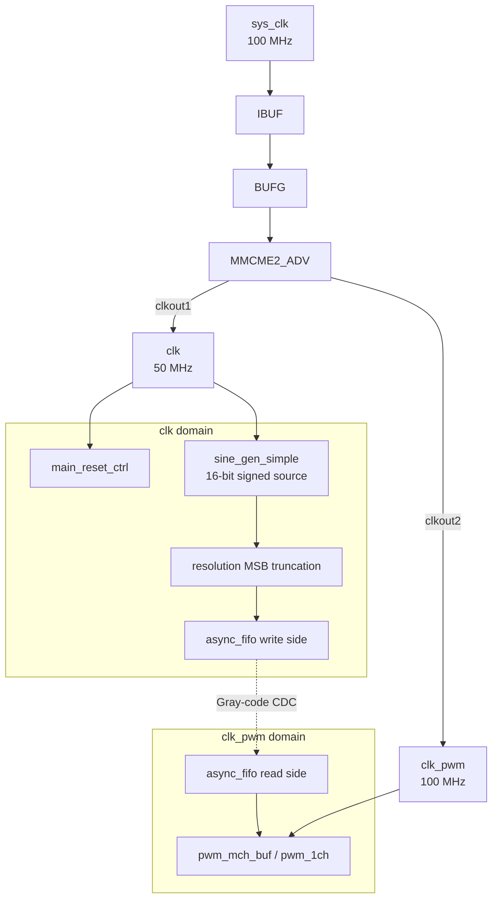

# Clock Domains

## Overview

The current top-level uses two generated clock domains. The `clk` domain runs control and the 16-bit source generator. The `clk_pwm` domain runs the selected buffered PWM branch after the asynchronous FIFO crossing.

## Clock Domain Architecture



## Clock Specifications

| Clock | Source | Multiply | Divide | Frequency | Period |
|-------|--------|----------|--------|-----------|--------|
| `sys_clk` | Board oscillator | - | - | 100 MHz | 10 ns |
| `clk` | MMCM `clkout1` | x8.0 | /16 | 50 MHz | 20 ns |
| `clk_pwm` | MMCM `clkout2` | x8.0 | /8 | 100 MHz | 10 ns |

The board XDC files constrain `sys_clk` at 10 ns. Keep the XDC clock period and `MMCME2_ADV.clkin*_period` metadata aligned if the board clock is changed.

## Data Rate Matching

Runtime resolution changes switch between fixed buffered branches. Each branch has a FIFO width, PWM frame length, and source request divider matched to that branch resolution.

| Resolution | PWM frame cycles | FIFO read rate | Source request divider |
|------------|------------------|----------------|------------------------|
| 4-bit | 32 | 3.125 MHz | 16 |
| 5-bit | 64 | 1.5625 MHz | 32 |
| 6-bit | 128 | 781.25 kHz | 64 |
| 7-bit | 256 | 390.625 kHz | 128 |
| 8-bit | 512 | 195.3125 kHz | 256 |

The source produces 16-bit signed samples. The top-level writes only the selected MSBs into the active branch FIFO, so FIFO data width and PWM resolution remain aligned.

## Synchronization Strategy

| Signal | From | To | Method |
|--------|------|----|--------|
| FIFO pointers | Between `clk` and `clk_pwm` | Opposite FIFO side | 2-stage Gray-code synchronizers inside `async_fifo` |
| `rst` | `clk` | `clk_pwm` | 3-stage synchronizer in `pwm_mch_buf` |
| `enable` | `clk` | `clk_pwm` | 3-stage synchronizer in `pwm_mch_buf` |
| `sys_rst` | Board input | `clk` | 2-stage synchronizer in `main_reset_ctrl` |
| `sys_pwm_mode` | Board input | `clk` | 3-stage synchronizer plus debounce in `main_reset_ctrl` |

## Timing Constraints

```tcl
create_clock -period 10.000 [get_ports sys_clk]

# Board buttons are asynchronous controls into main_reset_ctrl.
set_false_path -from [get_ports {sys_rst sys_pwm_mode}]

# PWM pins drive off-board loads in the checked-in constraints.
set_false_path -to [get_ports {
  sys_pwm[0] sys_pwm[1] sys_pwm[2] sys_pwm[3]
  sys_pwm_n[0] sys_pwm_n[1] sys_pwm_n[2] sys_pwm_n[3]
}]
```

## Reset and Resolution Handoff

`main_reset_ctrl` keeps both `sine_rst` and `pwm_rst` asserted while MMCM lock is absent or reset is requested. Reset returns the runtime selector to 6-bit mode.

A debounced rising edge on `sys_pwm_mode` blanks the outputs, holds the sine source and PWM/FIFO branches in reset, waits `pwm_mode_switch_delay_cycles`, commits the next resolution, and then releases reset after `reset_release_cycles`. Inactive branches remain reset so stale FIFO data is not reused.

`sys_led` is generated in the `clk` domain. It is off during reset and resolution handoff, then repeatedly blinks the active resolution count from 4 through 8 before pausing.

## Debug

Normal Z7-Lite and Zybo builds are hardware-button controlled. With `debug=DEBUG`, VIO can force or override reset and the resolution-step input, and ILA observes the effective controls, selected resolution, and PWM outputs.
