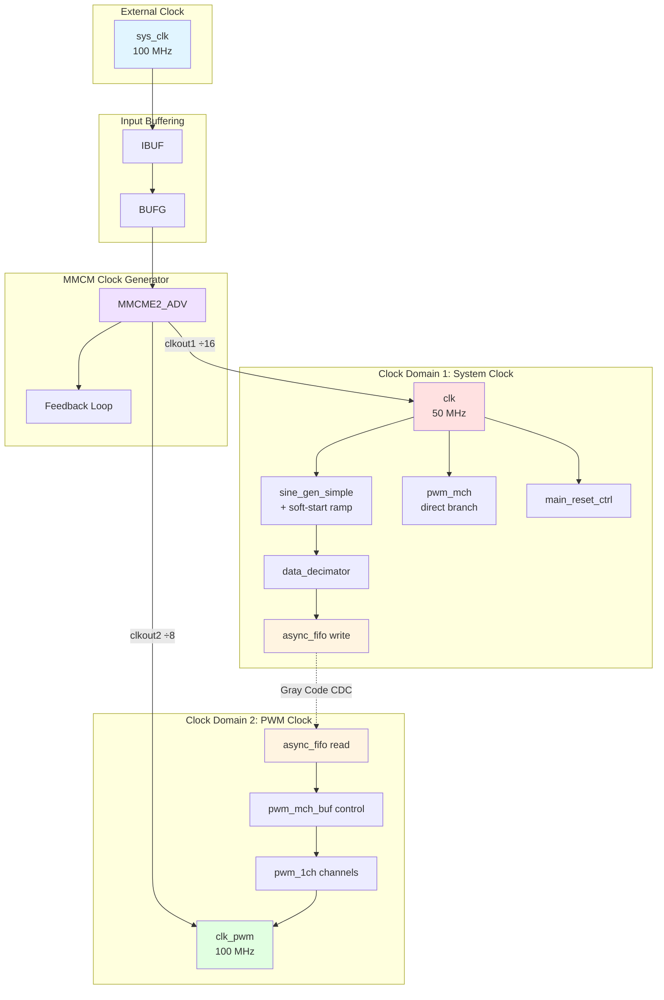
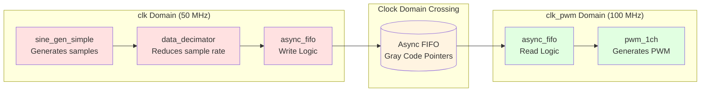
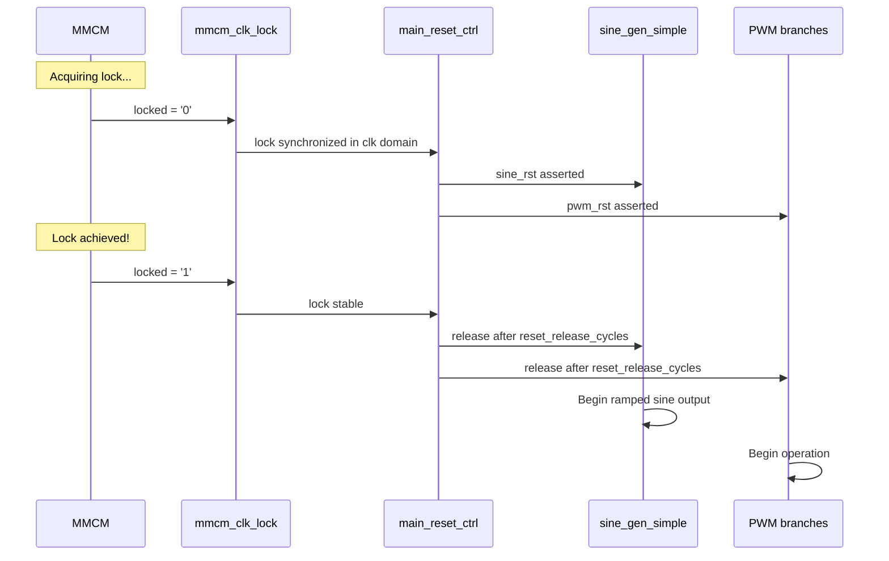

# Clock Domains

## Overview

The PWM Demo design implements two distinct clock domains. The `clk` domain generates the sine source and runs the direct PWM branch. The `clk_pwm` domain runs the buffered PWM branch after the FIFO crossing.

## Clock Domain Architecture



---

## Clock Specifications

### Input Clock

| Parameter | Value | Notes |
|-----------|-------|-------|
| Source | External oscillator | Board-dependent |
| Frequency | 100 MHz | 10 ns period in `Z7_LITE.xdc` and `Zybo_board.xdc` |
| Jitter | <50 ps typical | Crystal oscillator |
| Input Pin | sys_clk | Defined in XDC |

### Generated Clocks

| Clock | Source | Multiply | Divide | Frequency | Period |
|-------|--------|----------|--------|-----------|--------|
| clk | MMCM clkout1 | ×8.0 | ÷16 | 50 MHz | 20 ns |
| clk_pwm | MMCM clkout2 | ×8.0 | ÷8 | 100 MHz | 10 ns |

### MMCM Configuration

```vhdl
mmcm_adv : component mmcme2_adv
  generic map (
    clkfbout_mult_f => 8.0,      -- VCO multiplication
    clkin1_period   => 8.0,      -- Source metadata in main.vhd
    clkin2_period   => 8.0,      -- Unused (clkinsel='1')
    clkout1_phase   => 0.0,      -- No phase shift
    clkout1_divide  => 16,
    clkout2_phase   => 0.0,      -- No phase shift
    clkout2_divide  => 8
  )
```

**Note**: The board XDC files currently constrain `sys_clk` at 10 ns, and the implementation timing reports show `clk = 50 MHz` and `clk_pwm = 100 MHz`. Keep the XDC clock period and MMCM input-period metadata aligned if the board clock is changed.

---

## Clock Domain Crossing

### Crossing Point

The buffered branch crosses from `clk` (50 MHz) to `clk_pwm` (100 MHz) at the asynchronous FIFO boundary.



### Data Rate Matching

```text
Buffered source request rate: 50 MHz / 64 = 781.25 kHz
Manual input decimation:      64 in the current top-level buffered branch

PWM cycle rate:               100 MHz / 128 = 781.25 kHz (r=6, symmetrical)
FIFO read rate:               781.25 kHz (once per PWM frame)

Result: source requests and PWM frame reads are intentionally matched.
```

### Synchronization Strategy

| Signal | From | To | Method |
|--------|------|-----|--------|
| FIFO pointers | Between `clk` and `clk_pwm` | Opposite FIFO side | 2-stage Gray-code synchronizers inside `async_fifo` |
| `rst` | clk | clk_pwm | 3-stage synchronizer in `pwm_mch_buf` |
| `enable` | clk | clk_pwm | 3-stage synchronizer in `pwm_mch_buf` |
| `buf_empty` | clk_pwm | clk_pwm | Read-domain FIFO flag, used directly by read control |

---

## Timing Constraints

### XDC Constraints

```tcl
# Input clock
create_clock -period 10.000 [get_ports sys_clk]

# Generated clocks are inferred from the MMCM by Vivado timing reports:
#   clk     = 20 ns
#   clk_pwm = 10 ns

# Board switches are asynchronous controls into main_reset_ctrl.
set_false_path -from [get_ports {sys_rst sys_pwm_mode}]

# PWM pins drive off-board loads, so the board XDCs mark them as
# asynchronous outputs until a downstream synchronous interface is added.
set_false_path -to [get_ports {
  sys_pwm[0] sys_pwm[1] sys_pwm[2] sys_pwm[3]
  sys_pwm_n[0] sys_pwm_n[1] sys_pwm_n[2] sys_pwm_n[3]
}]
```

---

## Reset Synchronization

### main_reset_ctrl



### Reset Logic

```vhdl
reset_ctrl : entity work.main_reset_ctrl
  generic map (
    pwm_mode_switch_delay_cycles => pwm_mode_switch_delay_cycles,
    reset_release_cycles         => reset_release_cycles
  )
  port map (
    clk              => clk,
    mmcm_clk_lock    => mmcm_clk_lock,
    rst_request      => rst_request,
    pwm_mode_request => pwm_mode_request,
    sine_rst         => sine_rst,
    pwm_rst          => pwm_rst,
    pwm_mode_sel     => pwm_mode_sel
  );
```

`main_reset_ctrl` keeps both `sine_rst` and `pwm_rst` asserted while MMCM lock is absent or reset is requested. A runtime `sys_pwm_mode` or VIO PWM-mode change asserts only `pwm_rst`, blanks the selected outputs, waits `pwm_mode_switch_delay_cycles`, and then commits `pwm_mode_sel`. The sine generator is left running during this mode handoff.

---

## Clock Skew Considerations

### Within Domain

- **clk domain**: Global buffer (BUFG) ensures <100 ps skew
- **clk_pwm domain**: Distributed via MMCM output buffer

### Across Domains

- **No timing relationship**: Asynchronous crossing handled by FIFO
- **Setup/hold**: Metastability MTBF > 1000 years with 2-stage sync

---

## Frequency Tolerance

### MMCM Accuracy

| Parameter | Value | Notes |
|-----------|-------|-------|
| Input jitter | <50 ps | Crystal oscillator |
| MMCM jitter | <200 ps | Added by MMCM |
| Total jitter | <250 ps | Peak-to-peak |

### Impact on PWM

```
PWM Frequency = clk_pwm / 2^(r+1)  [symmetrical]

For clk_pwm = 100 MHz, r = 6:
PWM = 100 MHz / 128 = 781.25 kHz

With ±250 ps jitter:
Frequency error < 0.01% (negligible)
```

---

## Power Management

### Clock Gating

The design does not implement explicit clock gating. Clocks run continuously once MMCM achieves lock.

### Dynamic Power

```
P_dynamic = α × C × V² × f

Where:
  α = activity factor (~0.1 for counters)
  C = load capacitance
  V = supply voltage (1.0V for Zynq)
  f = clock frequency

clk domain (50 MHz):      board- and activity-dependent
clk_pwm domain (100 MHz): board- and activity-dependent
```

---

## Debug and Testing

### VIO/ILA Debug Build

The top-level `debug` generic defaults to `"NO_DEBUG"`. Passing `debug=DEBUG` to the Vivado board scripts instantiates generated `vio_pwm_debug` and `ila_pwm_debug` IP cores.

The VIO runs on the internal `clk` domain and provides reset and PWM mode force controls plus override-enable/value controls. Force mode preserves the board inputs; override mode can drive the effective control low or high when a physical input is fixed. The ILA captures physical, VIO, effective, and synchronized reset/mode controls plus fixed 4-bit selected PWM/PWM_N probe vectors.

---

## See Also

- [Architecture Overview](./overview.md)
- [Module Hierarchy](./hierarchy.md)
- [Async FIFO Documentation](../src/buffers/README.md)
- [Top-Level Design](../src/main.md)
