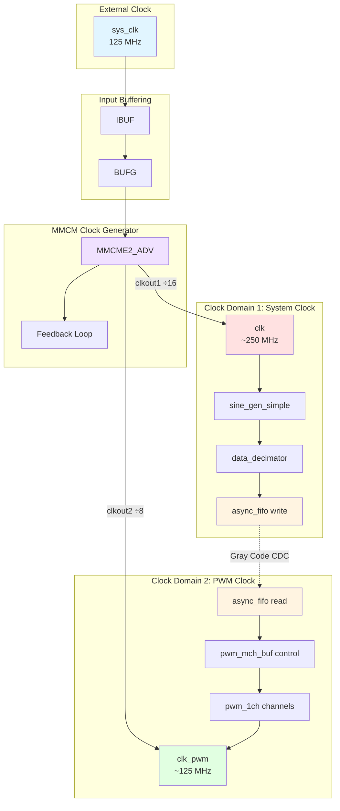
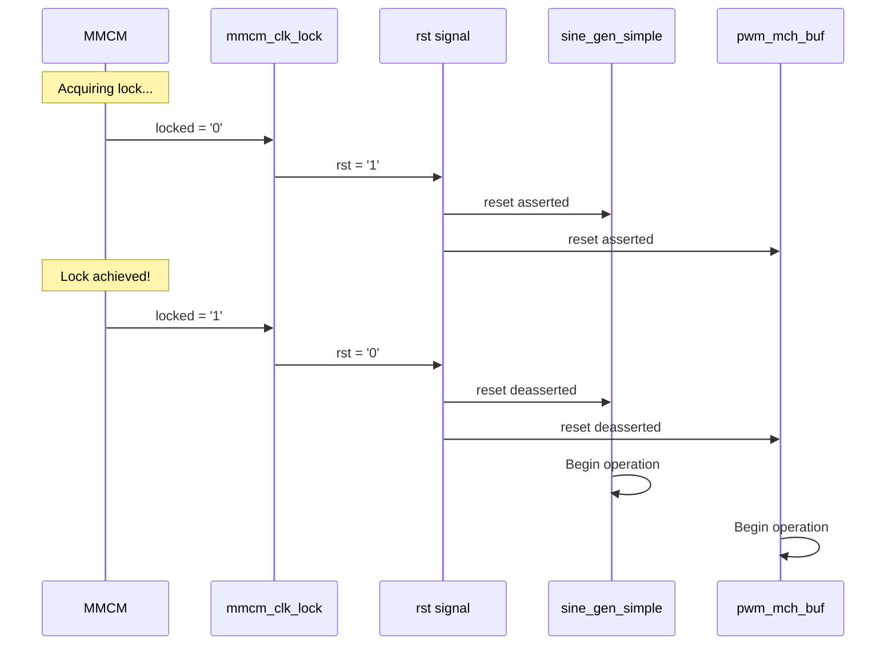

# Clock Domains

## Overview

The PWM Demo design implements two distinct clock domains to separate the high-frequency sine wave generation from the PWM modulation logic.

## Clock Domain Architecture



---

## Clock Specifications

### Input Clock

| Parameter | Value | Notes |
|-----------|-------|-------|
| Source | External oscillator | Board-dependent |
| Frequency | 125 MHz | 8 ns period |
| Jitter | <50 ps typical | Crystal oscillator |
| Input Pin | sys_clk | Defined in XDC |

### Generated Clocks

| Clock | Source | Multiply | Divide | Frequency | Period |
|-------|--------|----------|--------|-----------|--------|
| clk | MMCM clkout1 | ×8.0 | ÷16 | ~250 MHz | ~4 ns |
| clk_pwm | MMCM clkout2 | ×8.0 | ÷8 | ~125 MHz | ~8 ns |

### MMCM Configuration

```vhdl
mmcm_adv : component mmcme2_adv
  generic map (
    clkfbout_mult_f => 8.0,      -- VCO multiplication
    clkin1_period   => 8.0,      -- 8 ns = 125 MHz
    clkin2_period   => 8.0,      -- Unused (clkinsel='1')
    clkout1_phase   => 0.0,      -- No phase shift
    clkout1_divide  => 16,       -- 1000/16 = 62.5 MHz*
    clkout2_phase   => 0.0,      -- No phase shift
    clkout2_divide  => 8         -- 1000/8 = 125 MHz
  )
```

**Note**: Actual frequencies may differ due to VCO constraints. The design targets 250 MHz for `clk` and 125 MHz for `clk_pwm`.

---

## Clock Domain Crossing

### Crossing Point

The design crosses from `clk` (250 MHz) to `clk_pwm` (125 MHz) at the asynchronous FIFO boundary.


### Data Rate Matching

```
Sine Generator Rate:  250 MHz (1 sample/clock)
Decimation Factor:    32 (configurable)
FIFO Write Rate:      250 MHz / 32 = 7.8125 MHz

PWM Cycle Rate:       125 MHz / 128 = 0.9765625 MHz (r=6, symmetrical)
FIFO Read Rate:       ~1 MHz (once per PWM cycle)

Result: Write rate > Read rate ✓
```

### Synchronization Strategy

| Signal | From | To | Method |
|--------|------|-----|--------|
| wr_ptr_gray | clk | clk_pwm | 2-stage synchronizer |
| rd_ptr_gray | clk_pwm | clk | 2-stage synchronizer |
| buf_empty | clk_pwm | clk | 3-stage synchronizer |
| buf_full | clk | clk_pwm | Not used (write faster than read) |

---

## Timing Constraints

### XDC Constraints

```tcl
# Input clock
create_clock -period 8.0 [get_ports sys_clk]

# Generated clocks
create_generated_clock -name clk \
  -source [get_pins mmcm_adv/CLKIN1] \
  -divide_by 16 -multiply_by 8 \
  [get_pins mmcm_adv/CLKOUT1]

create_generated_clock -name clk_pwm \
  -source [get_pins mmcm_adv/CLKIN1] \
  -divide_by 8 -multiply_by 8 \
  [get_pins mmcm_adv/CLKOUT2]

# False paths for clock domain crossing
set_false_path -from [get_clocks clk] -to [get_clocks clk_pwm] \
  -through [get_pins *rd_ptr_gray_wr*/D]
set_false_path -from [get_clocks clk_pwm] -to [get_clocks clk] \
  -through [get_pins *wr_ptr_gray_rd*/D]

# Synchronizer multi-cycle paths
set_multicycle_path -setup -from [get_cells *sync*] 2
set_multicycle_path -hold -from [get_cells *sync*] 1
```

---

## Reset Synchronization

### MMCM Lock Detection



### Reset Logic

```vhdl
enable_control : process (mmcm_clk_lock) is
begin
  if (mmcm_clk_lock = '1') then
    rst <= '0';  -- Deassert reset when locked
  end if;
end process;
```

---

## Clock Skew Considerations

### Within Domain

- **clk domain**: Global buffer (BUFG) ensures <100 ps skew
- **clk_pwm domain**: Distributed via MMCM output buffer

### Across Domains

- **No timing relationship**: Asynchronous crossing handled by FIFO
- **Setup/hold**: Metastability MTBF > 1000 years with 2-stage sync

---

## Frequency Tolerance

### MMCM Accuracy

| Parameter | Value | Notes |
|-----------|-------|-------|
| Input jitter | <50 ps | Crystal oscillator |
| MMCM jitter | <200 ps | Added by MMCM |
| Total jitter | <250 ps | Peak-to-peak |

### Impact on PWM

```
PWM Frequency = clk_pwm / (2^(r+1) × 2)  [symmetrical]

For clk_pwm = 125 MHz, r = 6:
PWM = 125 MHz / 128 = 0.9765625 MHz ≈ 1 MHz

With ±250 ps jitter:
Frequency error < 0.01% (negligible)
```

---

## Power Management

### Clock Gating

The design does not implement explicit clock gating. Clocks run continuously once MMCM achieves lock.

### Dynamic Power

```
P_dynamic = α × C × V² × f

Where:
  α = activity factor (~0.1 for counters)
  C = load capacitance
  V = supply voltage (1.0V for Zynq)
  f = clock frequency

clk domain (250 MHz):    ~50 mW
clk_pwm domain (125 MHz): ~30 mW
Total:                    ~80 mW
```

---

## Debug and Testing

### ILA (Integrated Logic Analyzer) Probes

```tcl
# Probe clock domains
create_debug_core ila_0 ila
set_property C_DATA_DEPTH 1024 [get_debug_cores ila_0]

# Probe clk domain signals
create_debug_port ila_0 clk_port_0
set_property PROBE_TYPE DATA_AND_TRIGGER [get_debug_ports ila_0/clk_port_0]
set_property PORT_WIDTH 16 [get_debug_ports ila_0/clk_port_0]
add_debug_port ila_0/clk_port_0 sine_out

# Probe clk_pwm domain signals
create_debug_port ila_0 clk_port_1
set_property PROBE_TYPE DATA_AND_TRIGGER [get_debug_ports ila_0/clk_port_1]
set_property PORT_WIDTH 8 [get_debug_ports ila_0/clk_port_1]
add_debug_port ila_0/clk_port_1 pwm_outputs
```

---

## See Also

- [Architecture Overview](./overview.md)
- [Module Hierarchy](./hierarchy.md)
- [Async FIFO Documentation](../src/buffers/README.md)
- [Top-Level Design](../src/main.md)
