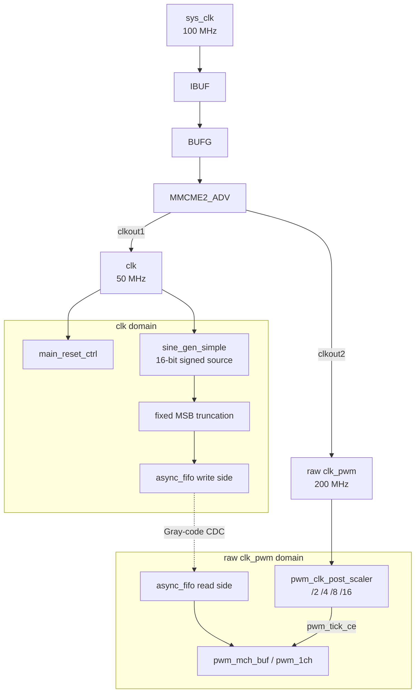

# Clock Domains

## Overview

The current top-level uses two generated clock domains. The `clk` domain runs control and the 16-bit source generator. The raw `clk_pwm` domain runs the buffered PWM branch and an internal post-scaler that emits the effective PWM tick.

## Clock Domain Architecture



## Clock Specifications

| Clock | Source | Multiply | Divide | Frequency | Period |
|-------|--------|----------|--------|-----------|--------|
| `sys_clk` | Board oscillator | - | - | 100 MHz | 10 ns |
| `clk` | MMCM `clkout1` | x8.0 | /16 | 50 MHz | 20 ns |
| raw `clk_pwm` | MMCM `clkout2` | x8.0 | /4 | 200 MHz | 5 ns |

The board XDC files constrain `sys_clk` at 10 ns. Keep the XDC clock period and `MMCME2_ADV.clkin*_period` metadata aligned if the board clock is changed.

## Buffered PWM Frequency

The fixed-resolution buffered branch uses `pwm_resolution_bits` at build time. Runtime button presses select the post-divider only.

| Divider | Effective tick | 8-bit symmetrical PWM frequency |
|---------|----------------|---------------------------------|
| `/2` | 100 MHz | 195.3125 kHz |
| `/4` | 50 MHz | 97.65625 kHz |
| `/8` | 25 MHz | 48.828125 kHz |
| `/16` | 12.5 MHz | 24.4140625 kHz |

For another build-time resolution:

```text
pwm_frequency = raw_clk_pwm_hz / (post_divider * 2 * 2**pwm_resolution_bits)
```

## Synchronization Strategy

| Signal | From | To | Method |
|--------|------|----|--------|
| FIFO pointers | Between `clk` and raw `clk_pwm` | Opposite FIFO side | 2-stage Gray-code synchronizers inside `async_fifo` |
| `rst` | `clk` | raw `clk_pwm` | 3-stage synchronizer in `pwm_mch_buf` |
| `enable` | `clk` | raw `clk_pwm` | 3-stage synchronizer in `pwm_mch_buf` |
| `pwm_div_sel` | `clk` | raw `clk_pwm` | 2-stage synchronizer in `pwm_mch_buf`; changes are made while PWM reset is asserted |
| `sys_rst` | Board input | `clk` | 2-stage synchronizer in `main_reset_ctrl` |
| `sys_pwm_mode` | Board input | `clk` | 3-stage synchronizer plus debounce in `main_reset_ctrl` |

## Timing Constraints

```tcl
create_clock -period 10.000 [get_ports sys_clk]

# Board buttons are asynchronous controls into main_reset_ctrl.
set_false_path -from [get_ports {sys_rst sys_pwm_mode}]

# PWM pins drive off-board loads in the checked-in constraints.
set_false_path -to [get_ports {
  sys_pwm[0] sys_pwm[1] sys_pwm[2] sys_pwm[3]
  sys_pwm_n[0] sys_pwm_n[1] sys_pwm_n[2] sys_pwm_n[3]
}]
```

## Reset and Divider Handoff

`main_reset_ctrl` keeps both `sine_rst` and `pwm_rst` asserted while MMCM lock is absent or reset is requested. Reset returns the runtime divider selector to `/2`.

A debounced rising edge on `sys_pwm_mode` blanks the outputs, holds the sine source and buffered PWM/FIFO path in reset, waits `pwm_mode_switch_delay_cycles`, commits the next divider, and then releases reset after `reset_release_cycles`.

`sys_led` is generated in the `clk` domain. It is off during reset and divider handoff, then repeatedly blinks 1 through 4 times for `/2`, `/4`, `/8`, and `/16`.

## Debug

Normal Z7-Lite and Zybo builds are hardware-button controlled. With `debug=DEBUG`, VIO can force or override reset and the divider-step input, and ILA observes the effective controls, selected divider, and PWM outputs.
