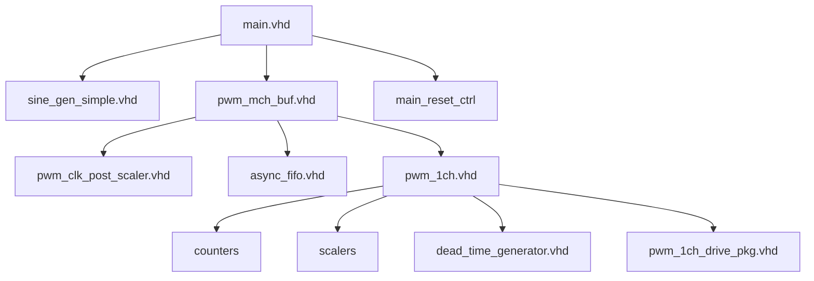

# Module Hierarchy

## Overview

This document shows the current PWM demo hierarchy after the fixed-resolution buffered PWM update. Runtime button control now selects a post-divider for `pwm_mch_buf`; it no longer switches among 4/5/6/7/8-bit branches.

## Complete Module Tree

```text
pwm_demo
├── src/main.vhd
│   ├── main_reset_ctrl
│   ├── IBUF / BUFG / MMCME2_ADV
│   ├── sine_gen_simple.vhd
│   ├── pwm_mch_buf.vhd
│   │   ├── pwm_clk_post_scaler.vhd
│   │   ├── async_fifo.vhd
│   │   ├── input_buffer_wr_ctrl
│   │   ├── input_buffer_rd_ctrl
│   │   ├── pwm_reg_ctrl
│   │   └── pwm_1ch.vhd × num_channels
│   │       ├── updown_counter_*.vhd / up_counter_*.vhd
│   │       ├── scaler_signed / scaler_unsigned / scaler_fp23
│   │       ├── pwm_1ch_drive_pkg.vhd
│   │       └── dead_time_generator.vhd
│   └── OBUF outputs
│
├── src/pwm_core/rtl
│   ├── pwm/pwm_mch.vhd
│   ├── pwm/pwm_1ch.vhd
│   ├── pwm/pwm_1ch_drive_pkg.vhd
│   ├── counters/*.vhd
│   ├── signal_chain/scaler_*.vhd
│   ├── fp23/fp23_pkg.vhd
│   └── utils/dead_time_generator.vhd, range_divider_pkg.vhd
│
├── src/pwm/pwm_mch_buf.vhd
├── src/signal_chain/sine_gen_simple.vhd
├── src/signal_chain/data_decimator.vhd
├── src/buffers/async_fifo.vhd
└── src/utils/pwm_clk_post_scaler.vhd, edge_delay.vhd
```

## Instantiation Hierarchy

```text
main
├─ sys_clk_ibuffer (IBUF)
├─ clk_gbuffer (BUFG)
├─ mmcm_adv (MMCME2_ADV)
├─ source_sine (sine_gen_simple)
├─ buffered_pwm (pwm_mch_buf)
├─ reset_ctrl (main_reset_ctrl)
└─ pwm_obufs[i] (OBUF)
```

```text
pwm_mch_buf
├─ post_scaler (pwm_clk_post_scaler) when use_post_scaler=true
├─ input_buffer (async_fifo)
├─ input_buffer_wr_ctrl
├─ input_buffer_rd_ctrl
├─ pwm_reg_ctrl
└─ channels_gen[i] (pwm_1ch)
```

```text
pwm_1ch
├─ Counter selected by ref_type and input_data_type
├─ Scaler selected by input_data_type
├─ dead_time_ctrl (dead_time_generator)
├─ input_control
└─ pwm_set_control
```

## Dependency Graph



## Clock Domain Map

| Module | Clock Domain | Frequency | Notes |
|--------|--------------|-----------|-------|
| `main.vhd` | Mixed | - | Contains both domains |
| `main_reset_ctrl` | `clk` | 50 MHz | Reset and divider handoff |
| `sine_gen_simple.vhd` | `clk` | 50 MHz | Source generation |
| `async_fifo.vhd` write | `clk` | 50 MHz | Source samples |
| `async_fifo.vhd` read | raw `clk_pwm` | 200 MHz | Buffered read side |
| `pwm_clk_post_scaler.vhd` | raw `clk_pwm` | 200 MHz | Emits `/2`, `/4`, `/8`, `/16` tick enables |
| `pwm_mch_buf.vhd` | raw `clk_pwm` | 200 MHz | Frame counter advances on `pwm_tick_ce` |
| `pwm_1ch.vhd` in `pwm_mch_buf` | raw `clk_pwm` | 200 MHz | Counter, drive, and dead-time advance on `tick_ce` |
| `pwm_mch.vhd` | Caller clock | - | Reusable direct PWM core; not used by current board top |

## Interface Notes

- `main.pwm_resolution_bits` sets the fixed buffered PWM resolution for a firmware build; default is 8.
- `main_reset_ctrl.pwm_div_sel` encodes `/2`, `/4`, `/8`, and `/16` as `00`, `01`, `10`, and `11`.
- `pwm_mch_buf.use_post_scaler` defaults to `false` so existing buffered tests and direct reuse can run at one tick per raw clock. The board top sets it to `true`.
- `pwm_1ch.tick_ce` defaults to `'1'`; the buffered path drives it from the post-scaler.

## File Locations

```text
src/
├── main.vhd
├── pwm/pwm_mch_buf.vhd
├── utils/pwm_clk_post_scaler.vhd
├── utils/edge_delay.vhd
├── buffers/async_fifo.vhd
├── signal_chain/
│   ├── sine_gen_simple.vhd
│   └── data_decimator.vhd
└── pwm_core/rtl/
    ├── pwm/
    ├── counters/
    ├── signal_chain/
    ├── fp23/
    └── utils/
```

## See Also

- [Architecture Overview](./overview.md)
- [Clock Domain Details](./clock_domains.md)
- [Documentation Index](../README.md)
