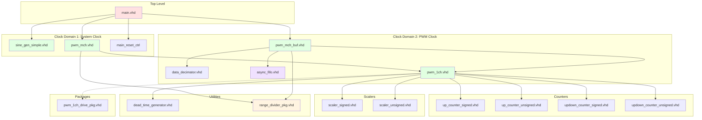

# Module Hierarchy

## Overview

This document provides a complete hierarchical view of all modules in the PWM Demo project.

## Complete Module Tree

```
pwm_demo (Project Root)
│
├── Top-Level Design
│   └── main.vhd
│       ├── main_reset_ctrl
│       ├── Clock System
│       │   ├── IBUF (Xilinx primitive)
│       │   ├── BUFG (Xilinx primitive)
│       │   └── MMCME2_ADV (Xilinx primitive)
│       │
│       ├── Signal Generation (clk domain)
│       │   └── sine_gen_simple.vhd
│       │       ├── generate_sine_wave() [function]
│       │       └── optional soft-start ramp
│       │
│       ├── Runtime Resolution PWM Generation (clk/clk_pwm domains)
│       │   ├── 16-bit source MSB truncation for 4/5/6/7/8-bit modes
│       │   └── pwm_mch_buf.vhd × 5
│       │       ├── data_decimator.vhd
│       │       ├── async_fifo.vhd
│       │       │   ├── bin2gray() [function]
│       │       │   └── gray2bin() [function]
│       │       ├── pwm_reg_ctrl [process]
│       │       │
│       │       └── pwm_1ch.vhd × N (channels)
│       │           ├── updown_counter_*.vhd / up_counter_*.vhd (carrier)
│       │           ├── scaler_signed / scaler_unsigned
│       │           ├── pwm_1ch_drive_pkg.vhd (pre-drive legs)
│       │           └── dead_time_generator.vhd
│       │
│       └── Output Selection
│           └── resolution mux blanked by pwm_rst
│
├── Reusable PWM Core (`src/pwm_core/rtl`)
│   ├── PWM Modules
│   │   ├── pwm_mch.vhd
│   │   ├── pwm_1ch.vhd
│   │   └── pwm_1ch_drive_pkg.vhd
│   ├── Counter Modules
│   │   ├── up_counter_signed.vhd
│   │   ├── up_counter_unsigned.vhd
│   │   ├── updown_counter_signed.vhd
│   │   └── updown_counter_unsigned.vhd
│   ├── Signal Chain Modules
│   │   ├── scaler_fp23.vhd
│   │   ├── scaler_signed.vhd
│   │   └── scaler_unsigned.vhd
│   ├── FP23 Helpers
│   │   └── fp23_pkg.vhd
│   └── Utility Modules
│       ├── dead_time_generator.vhd
│       └── range_divider_pkg.vhd
│
├── Demo-Specific Modules
│   ├── signal_chain/sine_gen_simple.vhd
│   ├── signal_chain/data_decimator.vhd
│   ├── buffers/async_fifo.vhd
│   ├── pwm/pwm_mch_buf.vhd
│   └── utils/edge_delay.vhd
│
└── Testbenches
    ├── tb_main.vhd
    ├── tb_pwm_1ch.vhd
    ├── tb_pwm_mch.vhd
    ├── tb_scalers.vhd
    ├── tb_counters.vhd
    ├── tb_async_fifo.vhd
    ├── tb_output_control.vhd
    └── tb_range_divider_pkg.vhd
```

---

## Instantiation Hierarchy

### Level 0: Top-Level (main.vhd)

```
main
│
├─► sys_clk_ibuffer (IBUF)
├─► clk_gbuffer (BUFG)
├─► mmcm_adv (MMCME2_ADV)
├─► dut_sine (sine_gen_simple)
├─► direct_pwm (pwm_mch)
├─► buffered_pwm (pwm_mch_buf)
├─► reset_ctrl (main_reset_ctrl)
└─► pwm_obufs[i] (OBUF) [generate loop]
```

### Level 1: pwm_mch_buf.vhd

```
pwm_mch_buf
│
├─► dec_sine (data_decimator)
├─► input_buffer (async_fifo)
├─► input_buffer_wr_ctrl [process]
├─► input_buffer_rd_ctrl [process]
├─► pwm_reg_ctrl [process]
│
└─► channels_gen[i] (pwm_1ch) [generate loop]
    ├─► set_pwm_t_signed (updown_counter_signed) [or asymmetrical]
    ├─► set_scaler_type_signed (scaler_signed) [or unsigned]
    ├─► dead_time_ctrl (dead_time_generator)
    ├─► input_control [process]
    └─► pwm_set_control [process]
```

### Level 2: pwm_1ch.vhd

```
pwm_1ch
│
├─► Counter (conditional generate)
│   ├─► SYMMETRICAL + SIGNED → updown_counter_signed
│   ├─► SYMMETRICAL + UNSIGNED → updown_counter_unsigned
│   ├─► ASYMMETRICAL + SIGNED → up_counter_signed
│   └─► ASYMMETRICAL + UNSIGNED → up_counter_unsigned
│
├─► Scaler (conditional generate)
│   ├─► SIGNED → scaler_signed
│   └─► UNSIGNED → scaler_unsigned
│
├─► dead_time_ctrl (dead_time_generator)
├─► pwm_1ch_drive_pkg (functions)
├─► input_control [process]
└─► pwm_set_control [process]
```

---

## Dependency Graph



---

## Clock Domain Map

| Module | Clock Domain | Frequency | Notes |
|--------|--------------|-----------|-------|
| main.vhd | Mixed | - | Contains both domains |
| IBUF/BUFG | Input | 100 MHz | Current board XDC clock |
| MMCME2_ADV | Internal | - | Clock generation |
| main_reset_ctrl | clk | 50 MHz | Synchronized reset and mode handoff |
| sine_gen_simple.vhd | clk | 50 MHz | System clock |
| pwm_mch.vhd | clk | 50 MHz | Direct PWM branch |
| data_decimator.vhd | clk | 50 MHz | System clock |
| async_fifo.vhd (write) | clk | 50 MHz | Write side |
| async_fifo.vhd (read) | clk_pwm | 100 MHz | Read side |
| pwm_mch_buf.vhd (read ctrl) | clk_pwm | 100 MHz | Buffered PWM clock |
| pwm_1ch.vhd in `pwm_mch_buf` | clk_pwm | 100 MHz | Buffered PWM channels |
| pwm_1ch.vhd in `pwm_mch` | clk | 50 MHz | Direct PWM channels |
| Counters/scalers/dead-time | Branch clock | 50 or 100 MHz | Clock follows direct or buffered parent |

---

## Module Interface Summary

### Top-Level Ports

```vhdl
entity main is
  generic (
    num_channels                 : integer := 4;
    debug                        : string  := "NO_DEBUG";
    pwm_mode_switch_delay_cycles : natural := 25_000_000;
    sine_wave_length             : positive := 2048;
    button_debounce_cycles       : positive := 1_000_000;
    reset_release_cycles         : positive := 5
  );
  port (
    sys_clk      : in    std_logic;
    sys_rst      : in    std_logic;
    sys_pwm_mode : in    std_logic;  -- legacy name, resolution/frequency-step button
    sys_pwm      : out   std_logic_vector(num_channels - 1 downto 0);
    sys_pwm_n    : out   std_logic_vector(num_channels - 1 downto 0)
  );
end entity;
```

### Signal Generator

```vhdl
entity sine_gen_simple is
  generic (
    wave_length : positive := 1024;
    bit_width   : positive := 16;
    data_type   : string   := "UNSIGNED";
    ramp_enable : boolean  := false;
    ramp_length : natural  := 0
  );
  port (
    clk         : in    std_logic;
    reset       : in    std_logic;
    output_data : out   std_logic_vector(bit_width - 1 downto 0)
  );
end entity;
```

### Multi-Channel PWM (Buffered)

```vhdl
entity pwm_mch_buf is
  generic (
    r               : integer   := 7;
    d               : integer   := 2;
    num_channels    : integer   := 2;
    input_data_type : string    := "SIGNED";
    buffer_depth    : integer   := 1024;
    ref_type        : string    := "SYMMETRICAL";
    ref_step        : integer   := 1;
    ref_updwn       : std_logic := '1';
    clk_freq_hz     : integer   := 100_000_000;
    clk_pwm_freq_hz : integer   := 200_000_000
  );
  port (
    clk        : in    std_logic;
    clk_pwm    : in    std_logic;
    rst        : in    std_logic;
    enable     : in    std_logic;
    input_wave : in    std_logic_vector(r - 1 downto 0);
    pwm        : out   std_logic_vector(num_channels - 1 downto 0);
    pwm_n      : out   std_logic_vector(num_channels - 1 downto 0)
  );
end entity;
```

### Single-Channel PWM

```vhdl
entity pwm_1ch is
  generic (
    r               : integer   := 7;
    input_width     : integer   := 7;
    d               : integer   := 2;
    input_data_type : string    := "SIGNED";
    ref_type        : string    := "SYMMETRICAL";
    scale_factor    : real      := 0.8;
    offset_factor   : real      := 0.1;
    fp23_binary_point : integer   := 6;
    ref_init          : integer   := 0;
    ref_step          : integer   := 1;
    ref_updwn         : std_logic := '1'
  );
  port (
    clk        : in    std_logic;
    rst        : in    std_logic;
    enable     : in    std_logic;
    input_wave : in    std_logic_vector(input_width - 1 downto 0);
    pwm        : out   std_logic;
    pwm_n      : out   std_logic
  );
end entity;
```

---

## File Locations

```
src/
├── main.vhd                              # Top-level design
├── pwm_core/rtl/
│   ├── pwm/
│   │   ├── pwm_1ch.vhd                   # Single-channel PWM
│   │   ├── pwm_1ch_drive_pkg.vhd         # Complementary drive functions
│   │   └── pwm_mch.vhd                   # Multi-channel direct PWM
│   ├── counters/
│   │   ├── up_counter_signed.vhd
│   │   ├── up_counter_unsigned.vhd
│   │   ├── updown_counter_signed.vhd
│   │   └── updown_counter_unsigned.vhd
│   ├── signal_chain/
│   │   ├── scaler_fp23.vhd
│   │   ├── scaler_signed.vhd
│   │   └── scaler_unsigned.vhd
│   ├── fp23/
│   │   └── fp23_pkg.vhd
│   └── utils/
│       ├── dead_time_generator.vhd
│       └── range_divider_pkg.vhd
├── pwm/
│   └── pwm_mch_buf.vhd                   # Multi-channel buffered wrapper
├── signal_chain/
│   ├── sine_gen_simple.vhd
│   └── data_decimator.vhd
├── buffers/
│   └── async_fifo.vhd
└── utils/
    └── edge_delay.vhd
```

---

## Resource Estimation

### Per-Channel Resources (Zynq-7000)

| Resource | Count | Notes |
|----------|-------|-------|
| LUTs | ~50 | Logic + comparators |
| FFs | ~40 | Pipeline registers |
| Counters | 1 | Up/down counter |
| Scalers | 1 | Amplitude scaling |
| Dead-time block | 1 | `dead_time_generator` per channel |

### Shared Resources

| Resource | Count | Notes |
|----------|-------|-------|
| Sine LUT | 1 | Block RAM (2048×6) |
| Async FIFO | 1 | Block RAM (1024×6) |
| MMCM | 1 | Clock generation |
| Decimator | 1 | Sample rate conversion |

### Total Estimate (4 channels)

| Resource | Total | Utilization (Z7020) |
|----------|-------|---------------------|
| LUTs | ~400 | <1% |
| FFs | ~300 | <1% |
| Block RAM | 3 | ~3% |
| MMCM | 1 | 50% |

---

## See Also

- [Architecture Overview](./overview.md)
- [Clock Domain Details](./clock_domains.md)
- [Documentation Index](../README.md)
