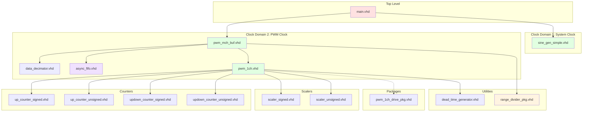

# Module Hierarchy

## Overview

This document provides a complete hierarchical view of all modules in the PWM Demo project.

## Complete Module Tree

```
pwm_demo (Project Root)
│
├── Top-Level Design
│   └── main.vhd
│       ├── Clock System
│       │   ├── IBUF (Xilinx primitive)
│       │   ├── BUFG (Xilinx primitive)
│       │   └── MMCME2_ADV (Xilinx primitive)
│       │
│       ├── Signal Generation (clk domain)
│       │   └── sine_gen_simple.vhd
│       │       └── generate_sine_wave() [function]
│       │
│       └── PWM Generation (clk_pwm domain)
│           └── pwm_mch_buf.vhd
│               ├── data_decimator.vhd
│               ├── async_fifo.vhd
│               │   ├── bin2gray() [function]
│               │   └── gray2bin() [function]
│               ├── pwm_reg_ctrl [process]
│               │
│               └── pwm_1ch.vhd × N (channels)
│                   ├── updown_counter_*.vhd / up_counter_*.vhd (carrier)
│                   ├── scaler_signed / scaler_unsigned
│                   ├── pwm_1ch_drive_pkg.vhd (pre-drive legs)
│                   └── dead_time_generator.vhd
│
├── Counter Modules
│   ├── up_counter_signed.vhd
│   ├── up_counter_unsigned.vhd
│   ├── updown_counter_signed.vhd
│   └── updown_counter_unsigned.vhd
│
├── Signal Chain Modules
│   ├── sine_gen_simple.vhd
│   ├── data_decimator.vhd
│   ├── scaler_signed.vhd
│   └── scaler_unsigned.vhd
│
├── Buffer Modules
│   └── async_fifo.vhd
│
├── Utility Modules
│   ├── dead_time_generator.vhd
│   ├── edge_delay.vhd
│   └── range_divider_pkg.vhd
│       ├── value_flag_pair [type]
│       ├── get_chunk_end()
│       ├── get_chunk_end_signed()
│       └── get_chunk_end_unsigned()
│
└── Testbenches
    ├── tb_main.vhd
    ├── tb_pwm_1ch.vhd
    ├── tb_pwm_mch.vhd
    ├── tb_scalers.vhd
    ├── tb_counters.vhd
    ├── tb_async_fifo.vhd
    ├── tb_sync_fifo.vhd
    ├── tb_output_control.vhd
    ├── tb_range_divider_pkg.vhd
    └── range_divider_pkg_tb.vhd
```

---

## Instantiation Hierarchy

### Level 0: Top-Level (main.vhd)

```
main
│
├─► sys_clk_ibuffer (IBUF)
├─► clk_gbuffer (BUFG)
├─► mmcm_adv (MMCME2_ADV)
├─► dut_sine (sine_gen_simple)
├─► adv_pwm (pwm_mch_buf)
└─► pwm_obufs[i] (OBUF) [generate loop]
```

### Level 1: pwm_mch_buf.vhd

```
pwm_mch_buf
│
├─► dec_sine (data_decimator)
├─► input_buffer (async_fifo)
├─► input_buffer_wr_ctrl [process]
├─► input_buffer_rd_ctrl [process]
├─► pwm_reg_ctrl [process]
│
└─► channels_gen[i] (pwm_1ch) [generate loop]
    ├─► set_pwm_t_signed (updown_counter_signed) [or asymmetrical]
    ├─► set_scaler_type_signed (scaler_signed) [or unsigned]
    ├─► dead_time_ctrl (dead_time_generator)
    ├─► input_control [process]
    └─► pwm_set_control [process]
```

### Level 2: pwm_1ch.vhd

```
pwm_1ch
│
├─► Counter (conditional generate)
│   ├─► SYMMETRICAL + SIGNED → updown_counter_signed
│   ├─► SYMMETRICAL + UNSIGNED → updown_counter_unsigned
│   ├─► ASYMMETRICAL + SIGNED → up_counter_signed
│   └─► ASYMMETRICAL + UNSIGNED → up_counter_unsigned
│
├─► Scaler (conditional generate)
│   ├─► SIGNED → scaler_signed
│   └─► UNSIGNED → scaler_unsigned
│
├─► dead_time_ctrl (dead_time_generator)
├─► pwm_1ch_drive_pkg (functions)
├─► input_control [process]
└─► pwm_set_control [process]
```

---

## Dependency Graph



---

## Clock Domain Map

| Module | Clock Domain | Frequency | Notes |
|--------|--------------|-----------|-------|
| main.vhd | Mixed | - | Contains both domains |
| IBUF/BUFG | Input | 125 MHz | External clock |
| MMCME2_ADV | Internal | - | Clock generation |
| sine_gen_simple.vhd | clk | 250 MHz | System clock |
| data_decimator.vhd | clk | 250 MHz | System clock |
| async_fifo.vhd (write) | clk | 250 MHz | Write side |
| async_fifo.vhd (read) | clk_pwm | 125 MHz | Read side |
| pwm_mch_buf.vhd (read ctrl) | clk_pwm | 125 MHz | PWM clock |
| pwm_1ch.vhd | clk_pwm | 125 MHz | PWM clock |
| All counters | clk_pwm | 125 MHz | PWM clock |
| All scalers | clk_pwm | 125 MHz | PWM clock |
| dead_time_generator | clk_pwm | 125 MHz | PWM clock |

---

## Module Interface Summary

### Top-Level Ports

```vhdl
entity main is
  generic ( num_channels : integer := 4 );
  port (
    sys_clk   : in    std_logic;
    sys_pwm   : out   std_logic_vector(num_channels - 1 downto 0);
    sys_pwm_n : out   std_logic_vector(num_channels - 1 downto 0)
  );
end entity;
```

### Signal Generator

```vhdl
entity sine_gen_simple is
  generic (
    wave_length : positive := 1024;
    bit_width   : positive := 16;
    data_type   : string   := "UNSIGNED"
  );
  port (
    clk         : in    std_logic;
    reset       : in    std_logic;
    output_data : out   std_logic_vector(bit_width - 1 downto 0)
  );
end entity;
```

### Multi-Channel PWM (Buffered)

```vhdl
entity pwm_mch_buf is
  generic (
    r               : integer   := 7;
    d               : integer   := 2;
    num_channels    : integer   := 2;
    input_data_type : string    := "SIGNED";
    buffer_depth    : integer   := 1024;
    ref_type        : string    := "SYMMETRICAL";
    output_mode     : string    := "COMPLEMENTARY";
    ref_step        : integer   := 1;
    ref_updwn       : std_logic := '1'
  );
  port (
    clk        : in    std_logic;
    clk_pwm    : in    std_logic;
    rst        : in    std_logic;
    enable     : in    std_logic;
    input_wave : in    std_logic_vector(r - 1 downto 0);
    pwm        : out   std_logic_vector(num_channels - 1 downto 0);
    pwm_n      : out   std_logic_vector(num_channels - 1 downto 0)
  );
end entity;
```

### Single-Channel PWM

```vhdl
entity pwm_1ch is
  generic (
    r               : integer   := 7;
    d               : integer   := 2;
    input_data_type : string    := "SIGNED";
    ref_type        : string    := "SYMMETRICAL";
    output_mode     : string    := "COMPLEMENTARY";
    scale_factor    : real      := 0.8;
    offset_factor   : real      := 0.1;
    ref_init        : integer   := 0;
    ref_step        : integer   := 1;
    ref_updwn       : std_logic := '1'
  );
  port (
    clk        : in    std_logic;
    rst        : in    std_logic;
    enable     : in    std_logic;
    input_wave : in    std_logic_vector(r - 1 downto 0);
    pwm        : out   std_logic;
    pwm_n      : out   std_logic
  );
end entity;
```

---

## File Locations

```
src/
├── main.vhd                              # Top-level design
├── pwm/
│   ├── pwm_1ch.vhd                       # Single-channel PWM
│   ├── pwm_1ch_drive_pkg.vhd           # Complementary / bipolar drive functions
│   ├── pwm_mch_buf.vhd                   # Multi-channel buffered
│   └── pwm_mch.vhd                       # Multi-channel (legacy)
├── counters/
│   ├── up_counter_signed.vhd
│   ├── up_counter_unsigned.vhd
│   ├── updown_counter_signed.vhd
│   └── updown_counter_unsigned.vhd
├── signal_chain/
│   ├── sine_gen_simple.vhd
│   ├── data_decimator.vhd
│   ├── scaler_signed.vhd
│   └── scaler_unsigned.vhd
├── buffers/
│   └── async_fifo.vhd
└── utils/
    ├── dead_time_generator.vhd
    ├── edge_delay.vhd
    └── range_divider_pkg.vhd
```

---

## Resource Estimation

### Per-Channel Resources (Zynq-7000)

| Resource | Count | Notes |
|----------|-------|-------|
| LUTs | ~50 | Logic + comparators |
| FFs | ~40 | Pipeline registers |
| Counters | 1 | Up/down counter |
| Scalers | 1 | Amplitude scaling |
| Dead-time block | 1 | `dead_time_generator` per channel |

### Shared Resources

| Resource | Count | Notes |
|----------|-------|-------|
| Sine LUT | 1 | Block RAM (2048×6) |
| Async FIFO | 1 | Block RAM (1024×6) |
| MMCM | 1 | Clock generation |
| Decimator | 1 | Sample rate conversion |

### Total Estimate (4 channels)

| Resource | Total | Utilization (Z7020) |
|----------|-------|---------------------|
| LUTs | ~400 | <1% |
| FFs | ~300 | <1% |
| Block RAM | 3 | ~3% |
| MMCM | 1 | 50% |

---

## See Also

- [Architecture Overview](./overview.md)
- [Clock Domain Details](./clock_domains.md)
- [Source Documentation](../src/README.md)
