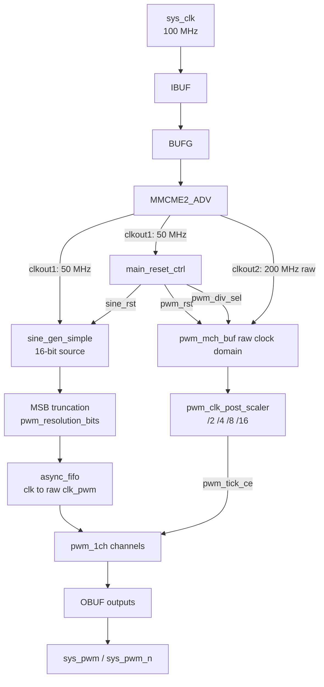

# Top-Level Architecture

## System Overview

The PWM demo is a fixed-resolution, buffered PWM generator for Zynq-7000 boards. The PWM resolution is selected at build time with `pwm_resolution_bits`; the board button changes only the buffered PWM post-divider at runtime.

## Block Diagram



## Clock Architecture

```text
Input Clock:     100 MHz
MMCM Multiply:   x8.0
VCO:             800 MHz

clkout1: 800 MHz / 16 = 50 MHz
clkout2: 800 MHz / 4  = 200 MHz raw clk_pwm
```

The raw `clk_pwm` clock is not divided in fabric. `pwm_clk_post_scaler` generates a one-cycle clock enable, `pwm_tick_ce`, and the buffered PWM logic advances on that tick.

## Runtime Frequency Modes

For symmetrical PWM:

```text
pwm_frequency = raw_clk_pwm_hz / (post_divider * 2 * 2**pwm_resolution_bits)
```

With the default `pwm_resolution_bits = 8` and raw `clk_pwm = 200 MHz`:

| Divider | Effective tick | PWM frequency | LED blinks |
|---------|----------------|---------------|------------|
| `/2` | 100 MHz | 195.3125 kHz | 1 |
| `/4` | 50 MHz | 97.65625 kHz | 2 |
| `/8` | 25 MHz | 48.828125 kHz | 3 |
| `/16` | 12.5 MHz | 24.4140625 kHz | 4 |

`sys_pwm_mode` cycles these modes with a blanked reset handoff.

## Module Hierarchy

```text
main.vhd
├── IBUF / BUFG / MMCME2_ADV
├── main_reset_ctrl
├── sine_gen_simple
├── pwm_mch_buf
│   ├── pwm_clk_post_scaler
│   ├── async_fifo
│   └── pwm_1ch × num_channels
│       ├── updown_counter_* / up_counter_*
│       ├── scaler_*
│       ├── pwm_1ch_drive_pkg
│       └── dead_time_generator
└── OBUF outputs
```

## Key Design Parameters

| Parameter | Value | Description |
|-----------|-------|-------------|
| Input Clock | 100 MHz | Current board XDC constraint |
| System Clock `clk` | 50 MHz | Source generation and reset control |
| Raw PWM Clock `clk_pwm` | 200 MHz | Buffered PWM domain |
| PWM Resolution | `pwm_resolution_bits`, default 8 | Build-time fixed resolution |
| Runtime Dividers | `/2`, `/4`, `/8`, `/16` | Button-selected post-scaled ticks |
| Number of Channels | 4 | Configurable default |
| Dead Time | 4 effective PWM ticks | Scales with selected post-divider |
| Buffer Depth | 16384 | FIFO depth for buffered samples |

## Clock Domain Crossing

The source side runs in the 50 MHz `clk` domain. The buffered PWM side runs in the raw 200 MHz `clk_pwm` domain. Sample data crosses domains through `async_fifo`; control signals are synchronized in `main_reset_ctrl` and `pwm_mch_buf`.

## See Also

- [main.vhd Documentation](../src/main.md)
- [PWM Modules](../src/pwm/README.md)
- [Clock Domain Details](./clock_domains.md)
- [Module Hierarchy](./hierarchy.md)
