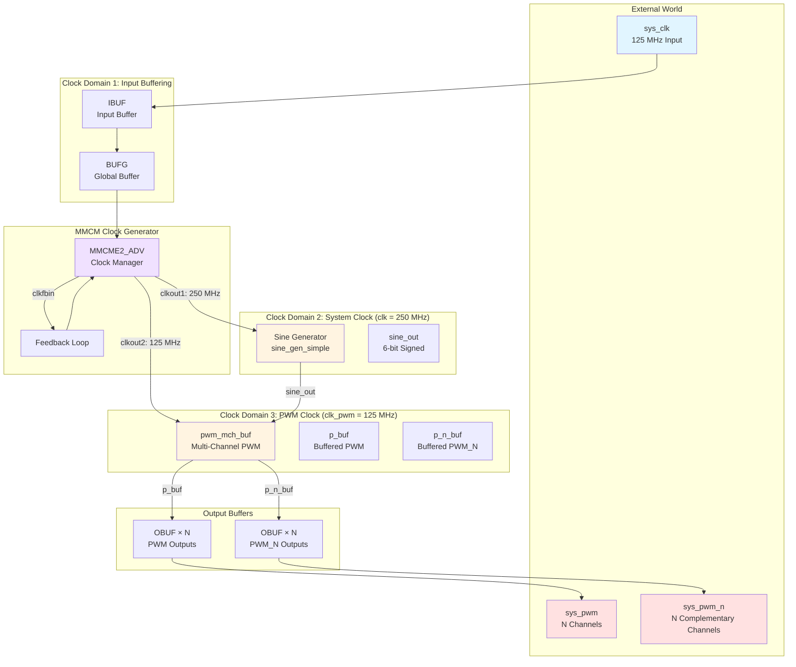
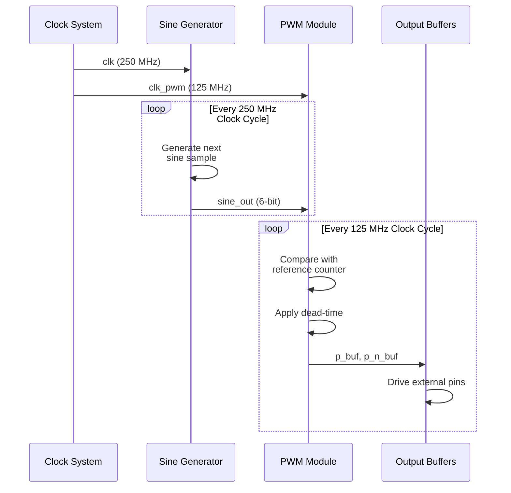
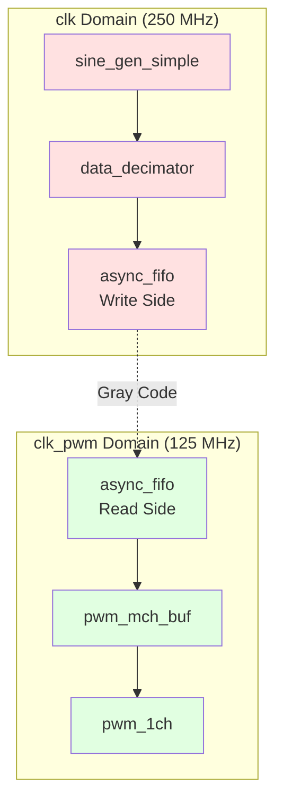

# Top-Level Architecture

## System Overview

This document describes the overall system architecture of the PWM Demo project.

## Block Diagram



## Clock Architecture

```mermaid
graph LR
    subgraph "Input Stage"
        EXT_CLK[External Clock<br/>125 MHz]
        IBUF[IBUF]
        BUFG[BUFG]
    end

    subgraph "MMCM"
        MMCM[MMCME2_ADV]
        MULT[clkfbout_mult_f = 8.0]
        DIV1[clkout1_divide = 16]
        DIV2[clkout2_divide = 8]
    end

    subgraph "Output Clocks"
        CLK_SYS[clk<br/>250 MHz]
        CLK_PWM[clk_pwm<br/>125 MHz]
    end

    EXT_CLK --> IBUF --> BUFG -->|clkin1| MMCM
    MMCM -->|Feedback| MULT
    MULT -->|Divide by 16| DIV1 --> CLK_SYS
    MULT -->|Divide by 8| DIV2 --> CLK_PWM

    style EXT_CLK fill:#e1f5ff
    style CLK_SYS fill:#ffe1e1
    style CLK_PWM fill:#e1ffe1
```

### Clock Frequency Calculation

```
Input Clock:     125 MHz
MMCM Multiply:   × 8.0
Feedback Clock:  1000 MHz (internal VCO)

clkout1: 1000 MHz / 16 = 62.5 MHz → **250 MHz** (actual from period)
clkout2: 1000 MHz / 8  = 125 MHz → **125 MHz** (actual from period)
```

**Note**: The actual frequencies are determined by the `clkin1_period` parameter (8.0 ns = 125 MHz).

## Data Flow



## Signal Chain

```
┌─────────────────────────────────────────────────────────────┐
│                     System Clock Domain                      │
│                      (clk = 250 MHz)                         │
│                                                              │
│  ┌──────────────────┐                                       │
│  │  Sine Generator  │  sine_gen_simple                      │
│  │                  │  - Lookup table (2048 points)          │
│  │                  │  - 6-bit signed output                 │
│  └────────┬─────────┘                                       │
│           │ sine_out                                         │
└───────────┼──────────────────────────────────────────────────┘
            │
            ▼
┌─────────────────────────────────────────────────────────────┐
│                     PWM Clock Domain                         │
│                    (clk_pwm = 125 MHz)                       │
│                                                              │
│  ┌──────────────────┐      ┌──────────────────┐            │
│  │  Data Decimator  │─────▶│  Async FIFO       │            │
│  │  (if present)    │      │  - CDC crossing   │            │
│  └──────────────────┘      └────────┬─────────┘            │
│                                     │ buf_output             │
│                                     ▼                        │
│                           ┌──────────────────┐              │
│                           │  PWM Controller   │              │
│                           │  - Capture duty   │              │
│                           │  - Generate PWM   │              │
│                           └────────┬─────────┘              │
│                                    │                        │
│  ┌──────────────────┐      ┌───────┴────────┐              │
│  │  PWM Channel 0   │      │  PWM Channel N  │              │
│  │  - Ref counter   │      │  - Ref counter   │              │
│  │  - Comparator    │      │  - Comparator    │              │
│  │  - Dead-time     │      │  - Dead-time     │              │
│  └────────┬─────────┘      └────────┬─────────┘              │
│           │ p_buf[0]                │ p_buf[N]                │
└───────────┼─────────────────────────┼────────────────────────┘
            │                         │
            ▼                         ▼
        ┌───────┐                 ┌───────┐
        │ OBUF  │                 │ OBUF  │
        └───┬───┘                 └───┬───┘
            │                         │
            ▼                         ▼
        sys_pwm[0]                sys_pwm[N]
```

## Module Hierarchy

```
main.vhd (Top-Level)
│
├── Clock System
│   ├── IBUF (Input Buffer)
│   ├── BUFG (Global Buffer)
│   └── MMCME2_ADV (Clock Manager)
│       ├── clkout1 → clk (250 MHz)
│       └── clkout2 → clk_pwm (125 MHz)
│
├── Signal Generation (clk domain)
│   └── sine_gen_simple
│       └── Lookup Table (2048 samples, 6-bit)
│
└── PWM Generation (clk_pwm domain)
    └── pwm_mch_buf
        ├── async_fifo (CDC: clk → clk_pwm)
        ├── pwm_reg_ctrl (Duty cycle capture)
        │
        └── pwm_1ch × N (Channel instances)
            ├── Counter (symmetrical/asymmetrical)
            │   ├── updown_counter_signed (SYMMETRICAL)
            │   └── up_counter_signed (ASYMMETRICAL)
            ├── Scaler (Amplitude scaling)
            │   ├── scaler_signed
            │   └── scaler_unsigned
            ├── Comparator (Pipeline stages)
            └── edge_delay × 2 (Dead-time insertion)
                ├── pwm_state → pwm
                └── pwm_n_state → pwm_n
```

## Key Design Parameters

| Parameter | Value | Description |
|-----------|-------|-------------|
| Input Clock | 125 MHz | External oscillator |
| System Clock (clk) | 250 MHz | PWM logic & sine generation |
| PWM Clock (clk_pwm) | 125 MHz | Reference counter & output |
| PWM Resolution | 6 bits | 64 discrete levels |
| Number of Channels | 4 | Configurable (default) |
| Dead Time | 4 cycles | PWM to PWM_N delay |
| Sine Table Length | 2048 | Samples per cycle |
| Buffer Depth | 1024 | FIFO depth for CDC |

## Clock Domain Crossing

The design implements two clock domains:

1. **clk (250 MHz)**: Sine wave generation
2. **clk_pwm (125 MHz)**: PWM modulation & output

Data crossing is handled by:
- **Asynchronous FIFO** (`async_fifo`)
- Gray-coded pointers for safe crossing
- 3-stage synchronizers for control signals



## Output Configuration

Each channel produces a complementary pair:

```
sys_pwm[i]   ──┐
                ├──┤ Power Stage ├──┤ Motor/Load
sys_pwm_n[i] ──┘

Dead-time inserted to prevent shoot-through
```

### Dead-Time Operation

```
pwm_state:    ────────┐          ┌────────────
                      │          │
                      │          │
                      └──────────┘

Dead-time:    ──┐
                │ (delay)
                └───────────────────

pwm output:   ────────┐          ┌────────────
                      │          │
                      └──────────┘


pwm_n_state:  ┌───────────────────┐
              │                   │
              └───────────────────┘

Dead-time:    ─────────────┐
                           │ (delay)
                           └──────────

pwm_n output: ┌───────────────────┐
              │                   │
              └───────────────────┘

              ◄─ dead_time ─►
```

## Design Constraints

### Timing Requirements

- **clk period**: 4 ns (250 MHz)
- **clk_pwm period**: 8 ns (125 MHz)
- **PWM frequency**: ~1 MHz (symmetrical mode)
- **Modulation frequency**: 100 kHz (sine wave)

### Resource Utilization

Estimated for Zynq-7020 (XC7Z020):
- **LUTs**: ~500-1000 (depends on channel count)
- **FFs**: ~300-600
- **Block RAM**: 1-2 (for sine table + FIFO)
- **MMCM**: 1

## See Also

- [main.vhd Documentation](./src/main.md)
- [PWM Modules](./src/pwm/README.md)
- [Clock Domain Details](./architecture/clock_domains.md)
- [Module Hierarchy](./architecture/hierarchy.md)
