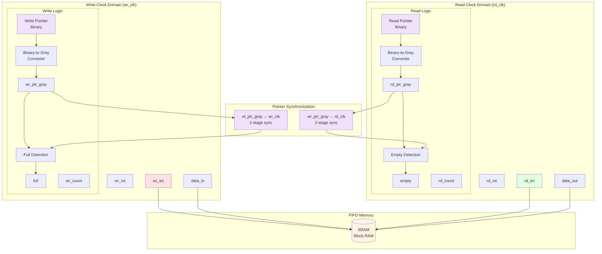
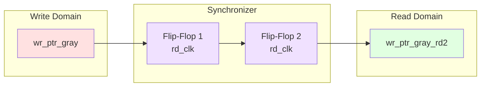
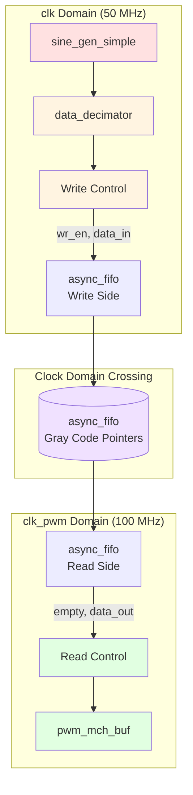

# Buffer Modules

## Overview

The buffer modules provide clock domain crossing (CDC) functionality using asynchronous FIFOs with Gray-coded pointers.

- **async_fifo.vhd**: Asynchronous FIFO for safe data transfer between clock domains

---

## async_fifo.vhd - Asynchronous FIFO

### Description

Implements a dual-clock FIFO buffer that safely transfers data between asynchronous clock domains using Gray code pointers and metastability-hardened synchronization.

### Block Diagram



### Entity Declaration

```vhdl
entity async_fifo is
  generic (
    data_width : integer := 8;
    fifo_depth : integer := 16  -- MUST be power of 2
  );
  port (
    -- Write Clock Domain
    wr_clk   : in    std_logic;
    wr_rst   : in    std_logic;
    wr_en    : in    std_logic;
    data_in  : in    std_logic_vector(data_width - 1 downto 0);
    full     : out   std_logic;
    wr_count : out   std_logic_vector(ceil(log2(fifo_depth + 1)) - 1 downto 0);

    -- Read Clock Domain
    rd_clk   : in    std_logic;
    rd_rst   : in    std_logic;
    rd_en    : in    std_logic;
    data_out : out   std_logic_vector(data_width - 1 downto 0);
    empty    : out   std_logic;
    rd_count : out   std_logic_vector(ceil(log2(fifo_depth + 1)) - 1 downto 0)
  );
end entity async_fifo;
```

### Generics

| Generic | Type | Default | Description |
|---------|------|---------|-------------|
| `data_width` | integer | 8 | Width of data bus |
| `fifo_depth` | integer | 16 | FIFO depth (must be power of 2) |

### Ports

| Port | Direction | Width | Clock Domain | Description |
|------|-----------|-------|--------------|-------------|
| `wr_clk` | in | 1 | Write | Write clock |
| `wr_rst` | in | 1 | Write | Write domain reset |
| `wr_en` | in | 1 | Write | Write enable |
| `data_in` | in | data_width | Write | Input data |
| `full` | out | 1 | Write | FIFO full flag |
| `wr_count` | out | variable | Write | Words in FIFO |
| `rd_clk` | in | 1 | Read | Read clock |
| `rd_rst` | in | 1 | Read | Read domain reset |
| `rd_en` | in | 1 | Read | Read enable |
| `data_out` | out | data_width | Read | Output data |
| `empty` | out | 1 | Read | FIFO empty flag |
| `rd_count` | out | variable | Read | Words in FIFO |

---

## Gray Code Encoding

### Why Gray Code?

Gray code ensures that only **one bit changes** between consecutive values, preventing metastability issues when crossing clock domains.

```
Binary:     000 → 001 → 010 → 011 → 100 → 101 → 110 → 111
Gray Code:  000 → 001 → 011 → 010 → 110 → 111 → 101 → 100
            ✓ Only 1 bit changes between consecutive values
```

### Conversion Functions

#### Binary to Gray

```vhdl
function bin2gray(bin : unsigned) return std_logic_vector is
begin
  return std_logic_vector(bin xor ('0' & bin(bin'high downto 1)));
end function;
```

**Example (4-bit):**
```
Binary:  0110 (6)
Shift:   0011
XOR:     0101 (Gray code for 6)
```

#### Gray to Binary

```vhdl
function gray2bin(gray : std_logic_vector) return unsigned is
  variable bin : unsigned(gray'range);
begin
  bin(bin'high) := gray(gray'high);
  for i in gray'high - 1 downto 0 loop
    bin(i) := bin(i + 1) xor gray(i);
  end loop;
  return bin;
end function;
```

**Example (4-bit):**
```
Gray:    0101
MSB:     0 → bin[3] = 0
Next:    0 xor 1 = 1 → bin[2] = 1
Next:    1 xor 0 = 1 → bin[1] = 1
LSB:     1 xor 1 = 0 → bin[0] = 0
Binary:  0110 (6) ✓
```

---

## FIFO Operation

### Write Process

```mermaid
graph TB
    subgraph "Write Domain (wr_clk)"
        START{wr_en='1'<br/>& !full?}
        
        START -->|Yes| WRITE[Write to memory<br/>mem[wr_ptr] <= data_in]
        START -->|No| IDLE[Hold state]
        
        WRITE --> INCR[Increment wr_ptr<br/>binary]
        INCR --> GRAY[Convert to Gray<br/>wr_ptr_gray]
        GRAY --> SYNC_RD[Sync rd_ptr_gray<br/>2-stage FF]
        SYNC_RD --> CHECK_FULL{Check Full<br/>wr_ptr == sync_rd_ptr?}
        
        CHECK_FULL -->|MSB diff,<br/>rest same| SET_FULL[full <= '1']
        CHECK_FULL -->|Otherwise| CLEAR_FULL[full <= '0']
        
        CHECK_FULL --> CALC[Calculate wr_count]
        CALC --> END_W[End Write Cycle]
        SET_FULL --> END_W
        CLEAR_FULL --> END_W
    end

    style START fill:#fff4e1
    style WRITE fill:#e1ffe1
    style SET_FULL fill:#ffe1e1
    style CLEAR_FULL fill:#e1ffe1
```

**Full Condition Check:**
```vhdl
-- FIFO is full when pointers match in all bits except MSB
if wr_ptr_bin(addr_width-1 downto 0) = gray2bin(rd_ptr_gray_wr2)(addr_width-1 downto 0) and
   wr_ptr_bin(addr_width) /= gray2bin(rd_ptr_gray_wr2)(addr_width) then
  full_i <= '1';
else
  full_i <= '0';
end if;
```

### Read Process

```mermaid
graph TB
    subgraph "Read Domain (rd_clk)"
        START{rd_en='1'<br/>& !empty?}
        
        START -->|Yes| READ[Read from memory<br/>data_out <= mem[rd_ptr]]
        START -->|No| IDLE[Hold state]
        
        READ --> INCR[Increment rd_ptr<br/>binary]
        INCR --> GRAY[Convert to Gray<br/>rd_ptr_gray]
        GRAY --> SYNC_WR[Sync wr_ptr_gray<br/>2-stage FF]
        SYNC_WR --> CHECK_EMPTY{Check Empty<br/>rd_ptr == sync_wr_ptr?}
        
        CHECK_EMPTY -->|Match| SET_EMPTY[empty <= '1']
        CHECK_EMPTY -->|No Match| CLEAR_EMPTY[empty <= '0']
        
        CHECK_EMPTY --> CALC[Calculate rd_count]
        CALC --> END_R[End Read Cycle]
        SET_EMPTY --> END_R
        CLEAR_EMPTY --> END_R
    end

    style START fill:#fff4e1
    style READ fill:#e1ffe1
    style SET_EMPTY fill:#ffe1e1
    style CLEAR_EMPTY fill:#e1ffe1
```

**Empty Condition Check:**
```vhdl
-- FIFO is empty when binary pointers are equal
if rd_ptr_bin = gray2bin(wr_ptr_gray_rd2) then
  empty_i <= '1';
else
  empty_i <= '0';
end if;
```

---

## Pointer Synchronization

### Metastability Prevention



**Why 2 Flip-Flops?**
1. **FF1**: May go metastable (unpredictable output)
2. **FF2**: Samples stable output from FF1
3. **Result**: Safe crossing with < 1 FIT (Failures In Time) rate

### Synchronization Timing

```
Write Domain (wr_clk):
    ─┐  ┌─┐  ┌─┐  ┌─┐  ┌─┐  ┌─
     └──┘ └──┘ └──┘ └──┘ └──┘
        ▲ wr_ptr_gray changes

Read Domain (rd_clk):
    ──┐  ┌───┐  ┌───┐  ┌───
      └──┘   └──┘   └──┘
         ▲        ▲
      wr_ptr_gray_rd1 (1st FF)
                ▲
         wr_ptr_gray_rd2 (2nd FF, stable)
```

---

## Memory Implementation

### Block RAM Configuration

```vhdl
type mem_type is array (0 to fifo_depth - 1) of std_logic_vector(data_width - 1 downto 0);
signal memory : mem_type;
attribute ram_style : string;
attribute ram_style of memory : signal is "block";
```

### Memory Map

```
FIFO Depth = 16, Data Width = 8

Address    Data
   0    ┌─────────┐
   1    │  byte 0 │
   2    │  byte 1 │
   3    │  byte 2 │
  ...   │   ...   │
  14    │ byte 14 │
  15    └─────────┘
```

---

## Fill Counters

### Write Count (Words Available to Read)

```vhdl
if wr_ptr_bin >= gray2bin(rd_ptr_gray_wr2) then
  wr_cnt <= resize(wr_ptr_bin - gray2bin(rd_ptr_gray_wr2), count_width);
else
  wr_cnt <= resize((2^(addr_width+1)) + wr_ptr_bin - gray2bin(rd_ptr_gray_wr2), count_width);
end if;
```

### Read Count (Space Available to Write)

```vhdl
if gray2bin(wr_ptr_gray_rd2) >= rd_ptr_bin then
  rd_cnt <= resize(gray2bin(wr_ptr_gray_rd2) - rd_ptr_bin, count_width);
else
  rd_cnt <= resize((2^(addr_width+1)) + gray2bin(wr_ptr_gray_rd2) - rd_ptr_bin, count_width);
end if;
```

---

## Usage in PWM System

### Integration with pwm_mch_buf



### Write Control Logic

```vhdl
input_buffer_wr_ctrl : process (clk) is
begin
  if rising_edge(clk) then
    if rst = '1' then
      buf_wr_en <= '0';
      buf_input <= (others => '0');
    elsif (buf_full = '0') and (valid_wave = '1') then
      buf_wr_en <= '1';
      buf_input <= dec_wave;
    else
      buf_wr_en <= '0';
    end if;
  end if;
end process;
```

### Read Control Logic

```vhdl
input_buffer_rd_ctrl : process (clk_pwm) is
  variable cnt : integer := 0;
  variable cycle_length : integer := 2^r;
begin
  -- Set cycle length based on ref_type
  if ref_type = "SYMMETRICAL" then
    cycle_length := 2^(r+1);  -- 128 for r=6
  else
    cycle_length := 2^r;      -- 64 for r=6
  end if;

  if rising_edge(clk_pwm) then
    if rst_pwm = '1' then
      cnt := 0;
      buf_rd_en <= '0';
      buf_rd_valid <= '0';
    elsif cnt = cycle_length - 1 then
      cnt := 0;
      buf_rd_valid <= buf_rd_en;

      if buf_empty = '0' then
        buf_rd_en <= '1';
      else
        buf_rd_en <= '0';
      end if;
    else
      buf_rd_en <= '0';
      buf_rd_valid <= buf_rd_en;
      cnt := cnt + 1;
    end if;
  end if;
end process;
```

---

## Design Characteristics

| Feature | Implementation |
|---------|----------------|
| **Memory Type** | Block RAM (distributed LUT fallback) |
| **Pointer Encoding** | Gray code (1-bit transition) |
| **Synchronization** | 2-stage flip-flop chain |
| **Full Detection** | MSB differs, rest match |
| **Empty Detection** | All bits match |
| **Fill Count** | Dynamic calculation |
| **Reset** | Synchronous per domain |

---

## Timing Constraints

### Required Constraints

```tcl
# False path between clock domains (async FIFO handles safely)
set_false_path -from [get_clocks wr_clk] -to [get_clocks rd_clk]
set_false_path -from [get_clocks rd_clk] -to [get_clocks wr_clk]

# Synchronizer paths (multi-cycle)
set_multicycle_path -setup -from [get_pins *sync*] 2
set_multicycle_path -hold -from [get_pins *sync*] 1
```

---

## Test Coverage

```
tb/
├── tb_async_fifo.vhd    -- Asynchronous FIFO tests
└── tb_main.vhd          -- Integration tests
```

### Test Scenarios

1. **Basic Read/Write**: Verify data integrity
2. **Full Condition**: Verify full flag assertion
3. **Empty Condition**: Verify empty flag assertion
4. **Wrap-around**: Test pointer wrapping
5. **Clock Crossing**: Different frequencies
6. **Reset Behavior**: Reset in both domains

---

## See Also

- [PWM Buffered Module](../pwm/README.md#pwm_mch_bufvhd)
- [Clock Domain Details](../../architecture/clock_domains.md)
- [Main Design](../main.md)
