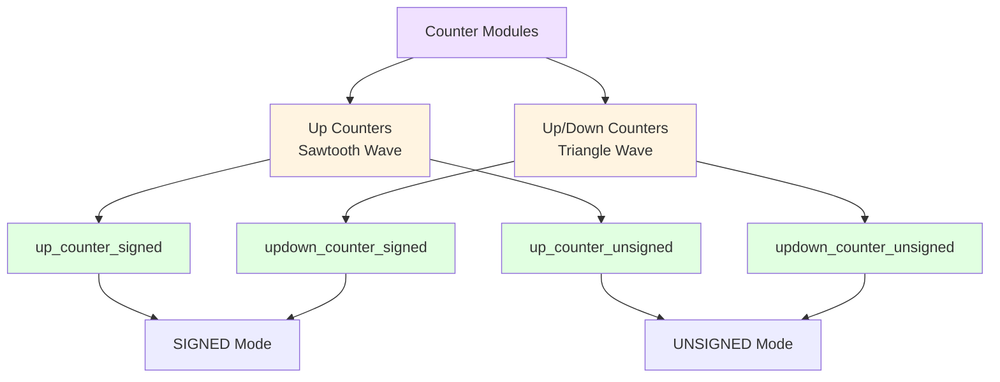
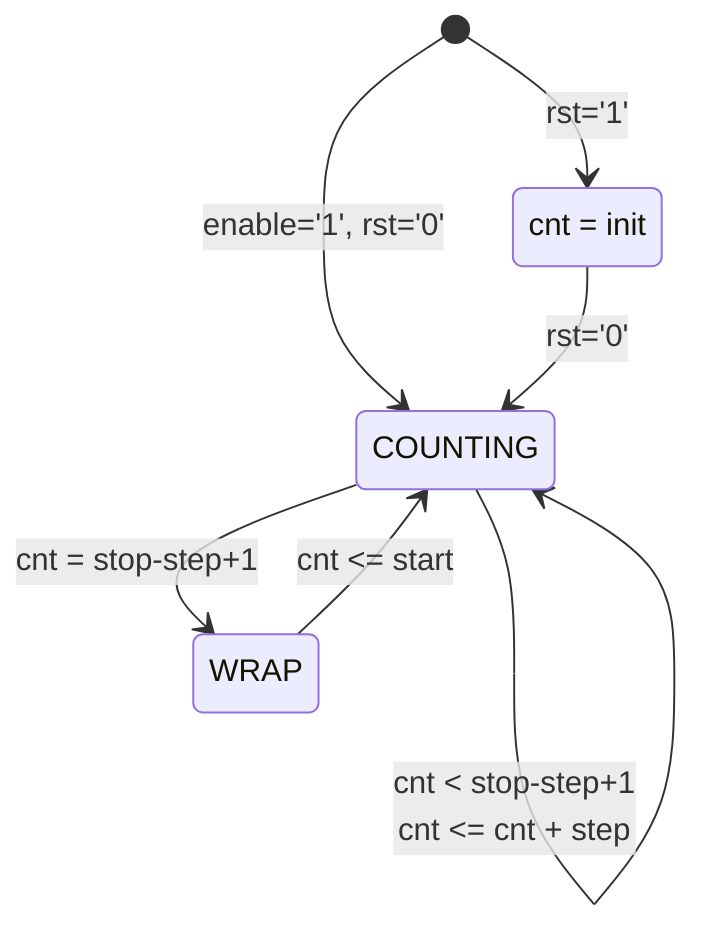
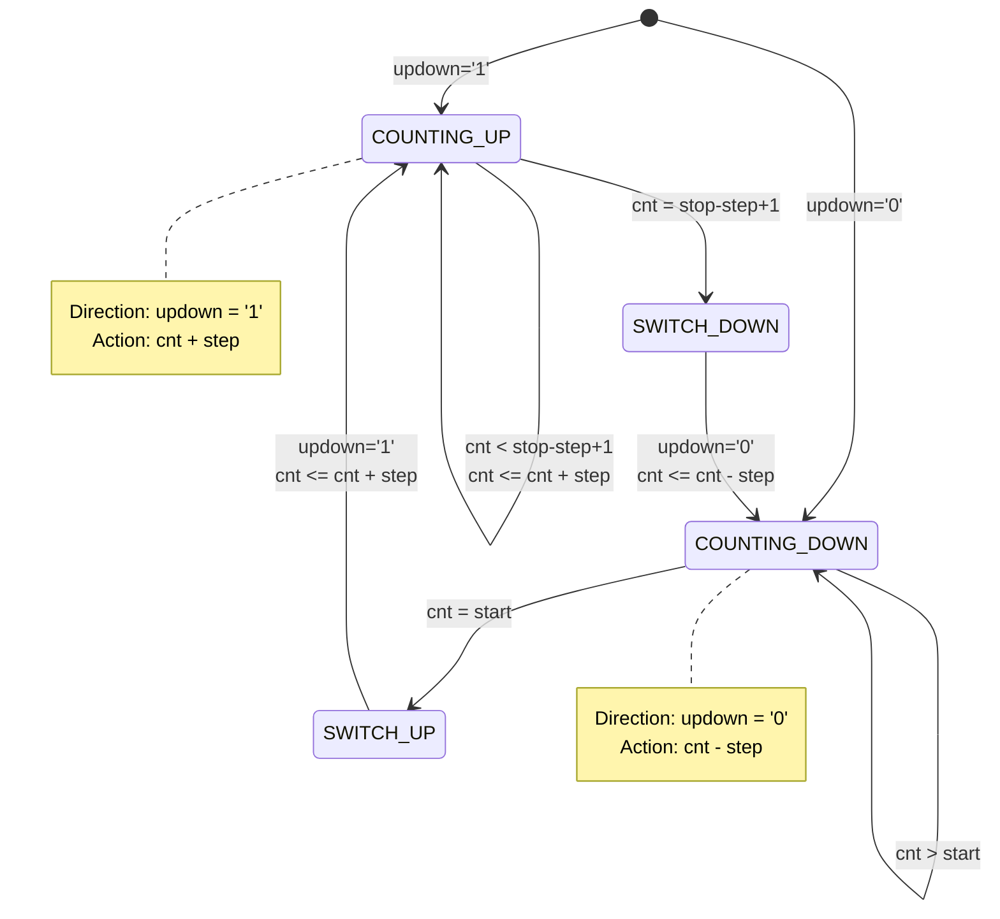
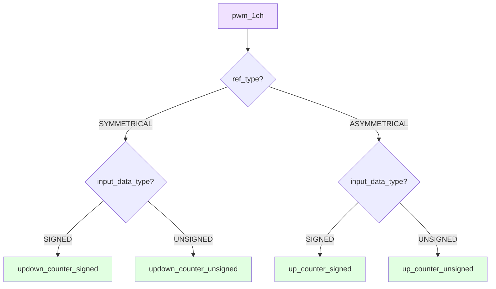

# Counter Modules

## Overview

The PWM system uses four counter implementations to generate reference waveforms:

- **up_counter_signed.vhd**: Signed up-counter (sawtooth)
- **up_counter_unsigned.vhd**: Unsigned up-counter (sawtooth)
- **updown_counter_signed.vhd**: Signed up/down counter (triangle)
- **updown_counter_unsigned.vhd**: Unsigned up/down counter (triangle)

## Module Hierarchy



---

## Up Counters

### Description

Generate sawtooth waveforms by counting up from START to STOP, then wrapping around.

### Waveform Diagram

```
SIGNED Mode (r=7):
    
    ▲ cnt
    │
 63 ┤                                    ┌────
    │                                   /
    │                                  /
    │                                 /
    │                                /
-64 ┤───────────────────────────────┘
    │
    └──────────────────────────────────────► time
      ◄──────── 2^r cycles ────────►


UNSIGNED Mode (r=7):
    
    ▲ cnt
    │
127 ┤                                    ┌────
    │                                   /
    │                                  /
    │                                 /
    │                                /
  0 ┤────────────────────────────────┘
    │
    └──────────────────────────────────────► time
      ◄──────── 2^r cycles ────────►
```

### up_counter_signed.vhd

#### Entity Declaration

```vhdl
entity up_counter_signed is
  generic (
    r     : integer := 7;   -- Resolution
    init  : integer := 0;   -- Initial value
    start : integer := -64; -- Min: -2^(r-1)
    stop  : integer := 63;  -- Max: 2^(r-1)-1
    step  : integer := 1    -- Increment
  );
  port (
    clk    : in    std_logic;
    rst    : in    std_logic;
    enable : in    std_logic;
    cnt    : out   std_logic_vector(r - 1 downto 0)
  );
end entity up_counter_signed;
```

#### Generics

| Generic | Type | Default | Description |
|---------|------|---------|-------------|
| `r` | integer | 7 | Counter resolution in bits |
| `init` | integer | 0 | Initial value on reset |
| `start` | integer | -64 | Start value (min) |
| `stop` | integer | 63 | Stop value (max) |
| `step` | integer | 1 | Increment step size |

#### Ports

| Port | Direction | Width | Description |
|------|-----------|-------|-------------|
| `clk` | in | 1 | Clock input |
| `rst` | in | 1 | Active-high reset |
| `enable` | in | 1 | Count enable |
| `cnt` | out | r | Counter output |

#### Operation



**Algorithm:**
```vhdl
if counter < (counter_max + 1 - step) then
    counter <= counter + step;
elsif counter = (counter_max + 1 - step) then
    counter <= counter_min;  -- Wrap to start
end if;
```

---

### up_counter_unsigned.vhd

#### Entity Declaration

```vhdl
entity up_counter_unsigned is
  generic (
    r     : integer := 7;   -- Resolution
    init  : integer := 0;   -- Initial value
    start : integer := 0;   -- Min: 0
    stop  : integer := 127; -- Max: 2^r-1
    step  : integer := 1    -- Increment
  );
  port (
    clk    : in    std_logic;
    rst    : in    std_logic;
    enable : in    std_logic;
    cnt    : out   std_logic_vector(r - 1 downto 0)
  );
end entity up_counter_unsigned;
```

#### Key Differences from Signed Version

| Feature | Signed | Unsigned |
|---------|--------|----------|
| Range | -2^(r-1) to 2^(r-1)-1 | 0 to 2^r-1 |
| Default start | -64 | 0 |
| Default stop | 63 | 127 |
| Representation | Two's complement | Binary |

---

## Up/Down Counters

### Description

Generate triangle waveforms by counting up to STOP, then down to START, alternating direction.

### Waveform Diagram

```
SIGNED Mode (r=7):
    
    ▲ cnt
    │         /\
 63 ┤        /  \
    │       /    \
    │      /      \
    │     /        \
    │    /          \
-64 ┤───┘            └───
    │
    └──────────────────────────────► time
    ◄────── 2^(r+1) cycles ──────►


UNSIGNED Mode (r=7):
    
    ▲ cnt
    │         /\
127 ┤        /  \
    │       /    \
    │      /      \
    │     /        \
    │    /          \
  0 ┤───┘            └───
    │
    └──────────────────────────────► time
    ◄────── 2^(r+1) cycles ──────►
```

### updown_counter_signed.vhd

#### Entity Declaration

```vhdl
entity updown_counter_signed is
  generic (
    r      : integer   := 7;   -- Resolution
    init   : integer   := 0;   -- Initial value
    start  : integer   := -64; -- Min value
    stop   : integer   := 63;  -- Max value
    step   : integer   := 1;   -- Increment
    updown : std_logic := '1'  -- Direction control
  );
  port (
    clk    : in    std_logic;
    rst    : in    std_logic;
    enable : in    std_logic;
    cnt    : out   std_logic_vector(r - 1 downto 0)
  );
end entity updown_counter_signed;
```

#### Generics

| Generic | Type | Default | Description |
|---------|------|---------|-------------|
| `r` | integer | 7 | Counter resolution in bits |
| `init` | integer | 0 | Initial value on reset |
| `start` | integer | -64 | Start value (min) |
| `stop` | integer | 63 | Stop value (max) |
| `step` | integer | 1 | Increment/decrement step |
| `updown` | std_logic | '1' | Initial direction ('1'=up) |

#### Operation



**Algorithm:**
```vhdl
if updown = '1' and counter < (counter_max + 1 - step) then
    counter <= counter + step;            -- Count up
elsif updown = '0' and counter > counter_min then
    counter <= counter - step;            -- Count down
elsif counter = counter_min then
    updown <= '1';                        -- Switch to up
    counter <= counter + step;
elsif counter = (counter_max + 1 - step) then
    updown <= '0';                        -- Switch to down
    counter <= counter - step;
end if;
```

---

### updown_counter_unsigned.vhd

#### Entity Declaration

```vhdl
entity updown_counter_unsigned is
  generic (
    r      : integer   := 7;   -- Resolution
    init   : integer   := 0;   -- Initial value
    start  : integer   := 0;   -- Min value
    stop   : integer   := 127; -- Max value
    step   : integer   := 1;   -- Increment
    updown : std_logic := '1'  -- Direction control
  );
  port (
    clk    : in    std_logic;
    rst    : in    std_logic;
    enable : in    std_logic;
    cnt    : out   std_logic_vector(r - 1 downto 0)
  );
end entity updown_counter_unsigned;
```

---

## Comparison Table

| Feature | up_counter_signed | up_counter_unsigned | updown_counter_signed | updown_counter_unsigned |
|---------|-------------------|---------------------|-----------------------|-------------------------|
| **Waveform** | Sawtooth | Sawtooth | Triangle | Triangle |
| **Range** | -64 to 63 | 0 to 127 | -64 to 63 | 0 to 127 |
| **Period** | 2^r cycles | 2^r cycles | 2^(r+1) cycles | 2^(r+1) cycles |
| **Direction** | Up only | Up only | Up/Down auto | Up/Down auto |
| **PWM Mode** | ASYMMETRICAL | ASYMMETRICAL | SYMMETRICAL | SYMMETRICAL |
| **Generics** | 5 | 5 | 6 | 6 |

---

## Usage in PWM System

### Counter Selection Logic



### Example Configuration

```vhdl
-- For symmetrical PWM with signed data:
cnt : entity work.updown_counter_signed
  generic map (
    r      => 6,          -- 6-bit resolution
    init   => -32,        -- Start at middle
    start  => -32,        -- Min value
    stop   => 31,         -- Max value
    step   => 1,          -- Increment by 1
    updown => '1'         -- Start counting up
  )
  port map (
    clk    => clk,
    rst    => rst,
    enable => enable,
    cnt    => counter
  );
```

---

## Design Optimization

### Registered Constants

All counters use registered constants to remove combinatorial conversion:

```vhdl
-- Pre-computed constants (no runtime conversion)
constant counter_min_reg  : signed(r-1 downto 0) := to_signed(start, r);
constant counter_max_reg  : signed(r-1 downto 0) := to_signed(stop, r);
constant counter_step_reg : signed(r-1 downto 0) := to_signed(step, r);
```

**Benefits:**
- Eliminates `to_signed()`/`to_unsigned()` from critical path
- Reduces combinational logic
- Improves timing closure

### Timing Performance

| Counter Type | Current Build Margin |
|--------------|----------------------|
| up_counter | Above the 100 MHz PWM branch clock |
| updown_counter | Above the 100 MHz PWM branch clock |

---

## Test Coverage

All counter modules have corresponding testbenches:

```
tb/
├── tb_counters.vhd          -- Generic counter tests
├── tb_pwm_1ch.vhd           -- Integration with PWM
└── tb_main.vhd              -- Top-level system tests
```

### Test Scenarios

1. **Reset behavior**: Verify counter resets to `init` value
2. **Wrap-around**: Verify correct wrap at boundaries
3. **Step sizes**: Test with various `step` values
4. **Enable control**: Verify counting stops when `enable='0'`
5. **Direction switching**: Verify up/down transitions

---

## See Also

- [PWM Modules](../pwm/README.md)
- [Range Divider Package](../utils/README.md#range_divider_pkgvhd---range-divider-package)
- [Counter Testbench](../../../tb/tb_counters.vhd)
