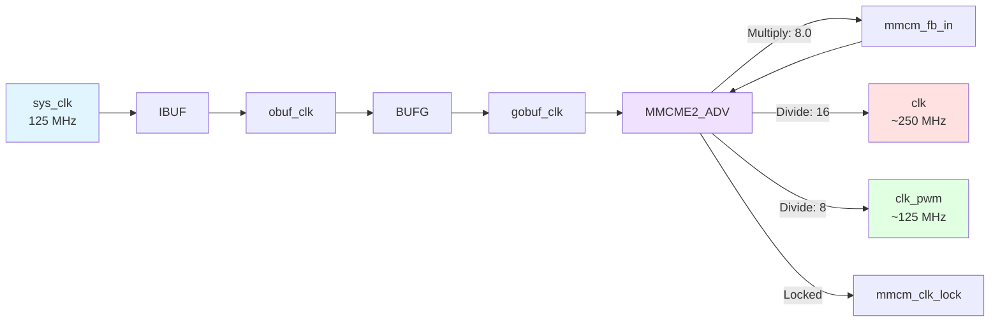
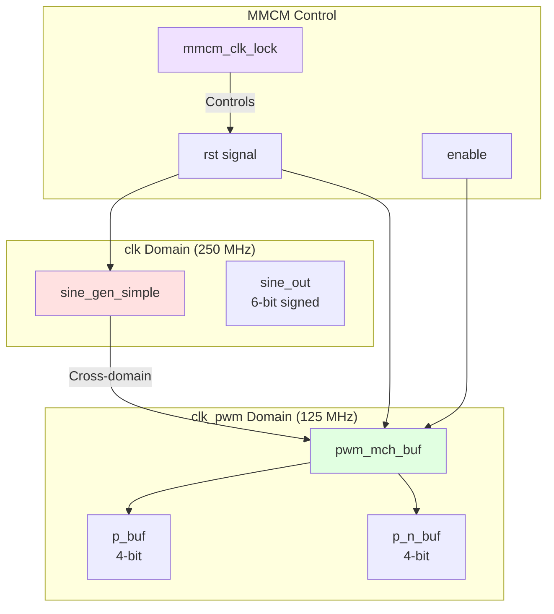
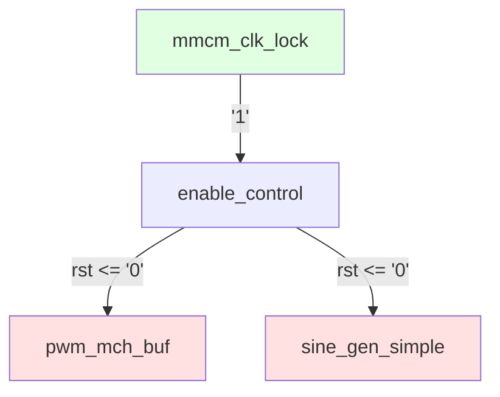
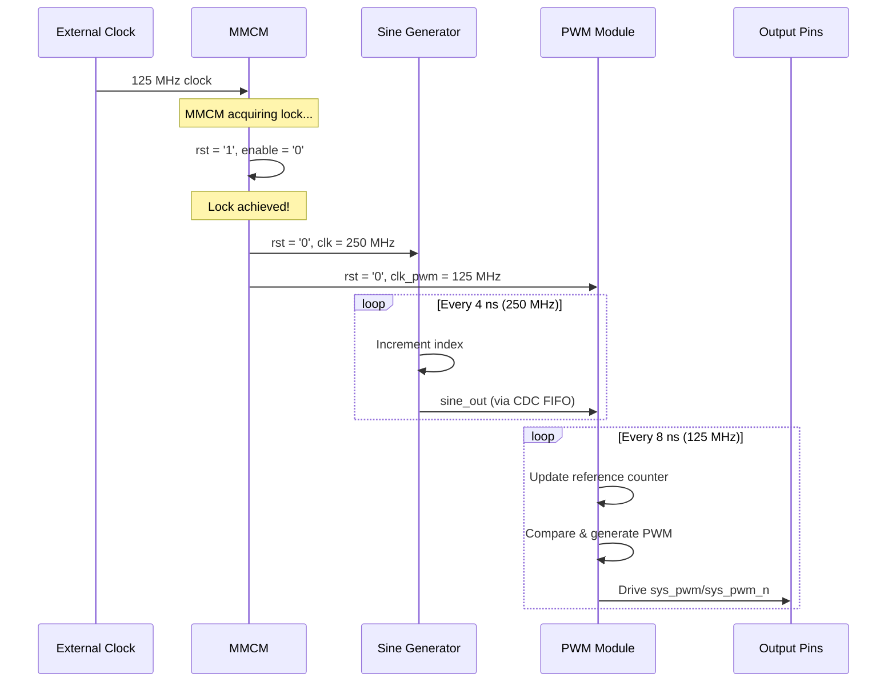

# main.vhd - Top-Level Design

## Overview

The top-level entity `main` orchestrates the entire PWM generation system. It manages clock distribution, sine wave generation, and multi-channel PWM output.

## Block Diagram

```mermaid
graph TB
    subgraph "Top-Level Entity: main"
        direction TB

        subgraph "Clock Input"
            SYS_CLK[sys_clk]
            IBUF[IBUF]
            BUFG[BUFG]
        end

        subgraph "Clock Generation"
            MMCM[MMCME2_ADV]
            FB[Feedback]
        end

        subgraph "Signal Generation Domain"
            SINE[sine_gen_simple<br/>2048 samples, 6-bit]
            SINE_OUT[sine_out]
        end

        subgraph "PWM Generation Domain"
            PWM[pwm_mch_buf<br/>4 channels]
            P_BUF[p_buf]
            P_N_BUF[p_n_buf]
        end

        subgraph "Output Stage"
            OBUF_P[OBUF × 4]
            OBUF_N[OBUF × 4]
        end
    end

    SYS_CLK --> IBUF --> BUFG --> MMCM
    MMCM -->|clkfbout| FB
    FB --> MMCM
    MMCM -->|clkout1: 250 MHz| SINE
    MMCM -->|clkout2: 125 MHz| PWM
    MMCM -->|locked| CTRL[Enable Control]

    SINE -->|sine_out| PWM
    CTRL -->|rst| PWM
    CTRL -->|rst| SINE

    PWM -->|p_buf| OBUF_P
    PWM -->|p_n_buf| OBUF_N
    OBUF_P --> SYS_PWM[sys_pwm[3:0]]
    OBUF_N --> SYS_PWM_N[sys_pwm_n[3:0]]

    style SYS_CLK fill:#e1f5ff
    style SYS_PWM fill:#ffe1e1
    style SYS_PWM_N fill:#ffe1e1
    style SINE fill:#fff4e1
    style PWM fill:#fff4e1
    style MMCM fill:#f0e1ff
```

## Entity Declaration

```vhdl
entity main is
  generic (
    num_channels : integer := 4        -- Number of PWM channels
  );
  port (
    sys_clk   : in    std_logic;       -- System clock input
    sys_pwm   : out   std_logic_vector(num_channels - 1 downto 0);
    sys_pwm_n : out   std_logic_vector(num_channels - 1 downto 0)
  );
end entity main;
```

## Generics

| Generic | Type | Default | Description |
|---------|------|---------|-------------|
| `num_channels` | integer | 4 | Number of PWM output channels (complementary pairs) |

## Ports

| Port | Direction | Width | Description |
|------|-----------|-------|-------------|
| `sys_clk` | in | 1 | External clock input (125 MHz) |
| `sys_pwm` | out | `num_channels` | PWM outputs (positive) |
| `sys_pwm_n` | out | `num_channels` | PWM outputs (negative/complementary) |

## Internal Constants

```vhdl
constant data_width           : integer   := 6;              -- PWM resolution
constant ref_init             : integer   := -2**6 / 2;      -- -32 (signed init)
constant num_dead_time_cycles : integer   := 4;              -- Dead-time duration
constant buffer_depth         : integer   := 1024;           -- FIFO depth
constant wave_length          : integer   := 2048;           -- Sine table size
constant input_data_type      : string    := "SIGNED";       -- Data format
constant ref_type             : string    := "SYMMETRICAL";  -- PWM mode
constant ref_step             : integer   := 1;              -- Counter increment
constant ref_updwn            : std_logic := '1';            -- Up/down control
```

## Architecture Details

### Clock Tree



### MMCM Configuration

```
┌─────────────────────────────────────────┐
│          MMCME2_ADV Configuration        │
├─────────────────────────────────────────┤
│ clkinsel        = '1'   (use clkin1)    │
│ clkin1_period   = 8.0   (8 ns = 125MHz) │
│ clkin2_period   = 8.0   (unused)        │
│ clkfbout_mult_f = 8.0   (VCO = 1000MHz) │
│                                         │
│ clkout1_divide  = 16    → 62.5 MHz*     │
│ clkout1_phase   = 0.0                   │
│                                         │
│ clkout2_divide  = 8     → 125 MHz       │
│ clkout2_phase   = 0.0                   │
│                                         │
│ * Actual: ~250 MHz (see timing)         │
└─────────────────────────────────────────┘
```

### Data Path



### Reset & Enable Control



**Behavior:**
- System starts with `rst = '1'`
- When MMCM achieves lock (`mmcm_clk_lock = '1'`), reset is deasserted
- Sine generator and PWM module begin operation

### Output Buffer Stage

```mermaid
graph TB
    P_BUF[p_buf] --> OBUF_P0[OBUF]
    P_N_BUF[p_n_buf] --> OBUF_N0[OBUF]

    OBUF_P0 --> SYS_PWM[sys_pwm[i]]
    OBUF_N0 --> SYS_PWM_N[sys_pwm_n[i]]

    subgraph "Channel i (0 to 3)"
        P_BUF
        P_N_BUF
        OBUF_P0
        OBUF_N0
    end

    style P_BUF fill:#fff4e1
    style P_N_BUF fill:#fff4e1
    style SYS_PWM fill:#ffe1e1
    style SYS_PWM_N fill:#ffe1e1
```

## Operational Sequence



## Signal Details

### Internal Signals

| Signal | Type | Width | Description |
|--------|------|-------|-------------|
| `ibuf_clk` | std_logic | 1 | After input buffer |
| `obuf_clk` | std_logic | 1 | After BUFG input |
| `gobuf_clk` | std_logic | 1 | Global clock to MMCM |
| `mmcm_fb_in` | std_logic | 1 | MMCM feedback |
| `mmcm_clk_lock` | std_logic | 1 | MMCM lock indicator |
| `clk` | std_logic | 1 | System clock (250 MHz) |
| `clk_pwm` | std_logic | 1 | PWM clock (125 MHz) |
| `rst` | std_logic | 1 | System reset |
| `enable` | std_logic | 1 | PWM enable (always '1') |
| `sine_out` | std_logic_vector | 6 | Sine wave output |
| `p_buf` | std_logic_vector | 4 | PWM positive outputs |
| `p_n_buf` | std_logic_vector | 4 | PWM negative outputs |

## Design Notes

### 1. Clock Buffer Chain

```
sys_clk → IBUF → BUFG → MMCM
```

This chain ensures:
- **IBUF**: Proper I/O buffering for external clock
- **BUFG**: Global clock network for low skew
- **MMCM**: Frequency synthesis and phase alignment

### 2. Unused Components

The following are commented out in the design:
- `simple_pwm`: Legacy non-buffered PWM module
- `IDELAYCTRL`: I/O delay calibration (not needed for this design)

### 3. Always-Enable Design

The `enable` signal is tied to `'1'`, meaning PWM generation is always active once reset is deasserted.

### 4. Complementary Outputs

Each channel produces:
- `sys_pwm[i]`: Positive PWM signal
- `sys_pwm_n[i]`: Complementary (inverted) PWM signal
- Dead-time inserted to prevent shoot-through

## Usage Example

### Instantiation

```vhdl
dut : entity work.main
  generic map (
    num_channels => 4
  )
  port map (
    sys_clk   => clk_125mhz,
    sys_pwm   => pwm_outputs,
    sys_pwm_n => pwm_outputs_n
  );
```

### Constraints File (XDC)

```tcl
# Clock input (125 MHz)
create_clock -period 8.0 [get_ports sys_clk]

# Output delays for PWM pins
set_output_delay -clock [get_clocks clk_pwm] ...
```

## Timing Information

### Clock Periods

| Clock | Period | Frequency |
|-------|--------|-----------|
| sys_clk | 8.0 ns | 125 MHz |
| clk | ~4.0 ns | ~250 MHz |
| clk_pwm | ~8.0 ns | ~125 MHz |

### PWM Characteristics

| Parameter | Value |
|-----------|-------|
| Resolution | 6 bits (64 levels) |
| PWM Frequency | ~1 MHz (symmetrical) |
| Modulation | 100 kHz sine wave |
| Dead Time | 4 × clk_pwm cycles (~32 ns) |

## See Also

- [Architecture Overview](../architecture/overview.md)
- [PWM Module Documentation](./pwm/README.md)
- [Sine Generator](./signal_chain/sine_gen_simple.md)
- [Clock Domain Details](../architecture/clock_domains.md)
