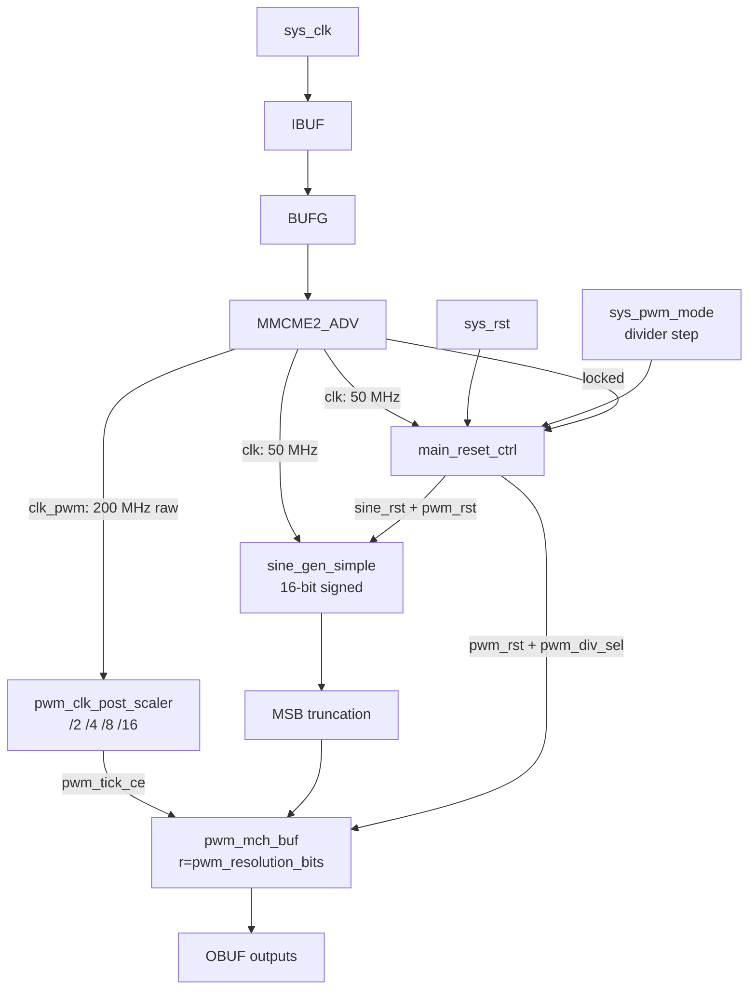

# main.vhd - Top-Level Design

## Overview

The top-level entity `main` builds the board-level PWM demo path used by the Z7-Lite and Zybo builds. It derives the internal clocks, generates a 16-bit signed pulse/sine source, truncates that source to one fixed PWM resolution, and drives one buffered PWM/FIFO branch.

The legacy input name `sys_pwm_mode` is kept so existing constraints and scripts still match the top-level port. In the current design it is a buffered-PWM frequency step button.

## Block Diagram



## Entity Declaration

```vhdl
entity main is
  generic (
    num_channels                 : integer := 4;
    debug                        : string  := "NO_DEBUG";
    pwm_resolution_bits          : positive := 8;
    pwm_mode_switch_delay_cycles : natural := 25_000_000;
    button_debounce_cycles       : positive := 1_000_000;
    resolution_led_on_cycles     : positive := 5_000_000;
    resolution_led_off_cycles    : positive := 5_000_000;
    resolution_led_pause_cycles  : positive := 25_000_000;
    reset_release_cycles         : positive := 5
  );
  port (
    sys_clk      : in    std_logic;
    sys_rst      : in    std_logic;
    sys_pwm_mode : in    std_logic;
    sys_led      : out   std_logic;
    sys_pwm      : out   std_logic_vector(num_channels - 1 downto 0);
    sys_pwm_n    : out   std_logic_vector(num_channels - 1 downto 0)
  );
end entity main;
```

## Runtime Divider Table

The top-level keeps one fixed PWM resolution and changes buffered PWM speed with a clock-enable post-scaler. For symmetrical PWM, `frame_cycles = 2 ** (pwm_resolution_bits + 1)`.

| Divider | Selector | LED blinks | 8-bit PWM frequency from 200 MHz raw `clk_pwm` |
|---------|----------|------------|------------------------------------------------|
| `/2` | `00` | 1 | 195.3125 kHz |
| `/4` | `01` | 2 | 97.65625 kHz |
| `/8` | `10` | 3 | 48.828125 kHz |
| `/16` | `11` | 4 | 24.4140625 kHz |

The general frequency formula is:

```text
pwm_frequency = raw_clk_pwm_hz / (post_divider * 2 * 2**pwm_resolution_bits)
```

Reset selects `/2`. Each valid press of `sys_pwm_mode` cycles `/2 -> /4 -> /8 -> /16 -> /2`.

## Reset and Button Behavior

- MMCM unlock or `sys_rst` asserts both `sine_rst` and `pwm_rst`, blanks all outputs, resets the source, and returns the divider selector to `/2`.
- `sys_pwm_mode` is synchronized and debounced in the `clk` domain.
- A debounced rising edge blanks the outputs, resets the sine source and PWM/FIFO branch, waits `pwm_mode_switch_delay_cycles`, commits the next divider, then releases reset after `reset_release_cycles`.
- `sys_led` reports the active divider mode as 1, 2, 3, or 4 blinks, followed by a pause.

## Data Path Notes

- `sine_gen_simple` produces a 16-bit signed sample.
- The selected PWM sample stores the signed MSBs: with the default `pwm_resolution_bits = 8`, bits `15 downto 8` are used.
- The buffered branch remains in the raw `clk_pwm` domain. The post-scaler emits `pwm_tick_ce`; FIFO frame counting, reference counter stepping, PWM state changes, and dead-time counting advance on that tick.
- The direct `pwm_mch` core is unchanged at top level; runtime frequency stepping applies only to `pwm_mch_buf`.
- The `debug` generic defaults to `NO_DEBUG`; `DEBUG` instantiates VIO/ILA for reset and divider-step debug.
