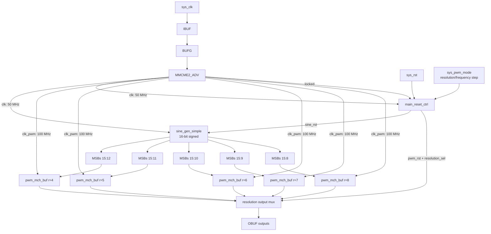

# main.vhd - Top-Level Design

## Overview

The top-level entity `main` builds the board-level PWM demo path used by the Z7-Lite and Zybo builds. It derives the internal clocks, generates a 16-bit signed pulse/sine source, truncates that source into fixed PWM resolutions, and selects one buffered PWM/FIFO branch at runtime.

The legacy input name `sys_pwm_mode` is kept so existing constraints and scripts still match the top-level port. In the current design it is a resolution/frequency-step button, not a direct/buffered mode selector.

## Block Diagram



## Entity Declaration

```vhdl
entity main is
  generic (
    num_channels                 : integer := 4;
    debug                        : string  := "NO_DEBUG";
    pwm_mode_switch_delay_cycles : natural := 25_000_000;
    button_debounce_cycles       : positive := 1_000_000;
    sine_wave_length             : positive := 2048;
    sine_pulse_period_cycles      : positive := 4096;
    sine_pulse_start_delay_cycles : natural  := 1024;
    sine_pulse_duration_cycles    : positive := 2048;
    sine_pulse_front_cycles       : natural  := 256;
    sine_pulse_fall_cycles        : natural  := 256;
    reset_release_cycles         : positive := 5
  );
  port (
    sys_clk      : in    std_logic;
    sys_rst      : in    std_logic;
    sys_pwm_mode : in    std_logic;
    sys_pwm      : out   std_logic_vector(num_channels - 1 downto 0);
    sys_pwm_n    : out   std_logic_vector(num_channels - 1 downto 0)
  );
end entity main;
```

## Runtime Resolution Table

The top-level keeps `clk_pwm` fixed and changes PWM speed by switching between fixed-resolution buffered branches. For symmetrical PWM, `frame_cycles = 2 ** (r + 1)`.

| Resolution | Selector | PWM frame cycles | PWM frequency | Source request divider |
|------------|----------|------------------|---------------|------------------------|
| 4-bit | `000` | 32 | 3.125 MHz | 16 |
| 5-bit | `001` | 64 | 1.5625 MHz | 32 |
| 6-bit | `010` | 128 | 781.25 kHz | 64 |
| 7-bit | `011` | 256 | 390.625 kHz | 128 |
| 8-bit | `100` | 512 | 195.3125 kHz | 256 |

Reset selects 6-bit mode. Each valid press of `sys_pwm_mode` cycles `6 -> 7 -> 8 -> 4 -> 5 -> 6`.

## Reset and Button Behavior

- MMCM unlock or `sys_rst` asserts both `sine_rst` and `pwm_rst`, blanks all outputs, resets the source, and returns the selector to 6-bit mode.
- `sys_pwm_mode` is synchronized and debounced in the `clk` domain.
- A debounced rising edge blanks the outputs, resets the sine source and PWM/FIFO branches, waits `pwm_mode_switch_delay_cycles`, commits the next resolution, then releases reset after `reset_release_cycles`.
- Inactive resolution branches stay held in reset, so their FIFOs cannot contain stale samples when they are not selected.

## Data Path Notes

- `sine_gen_simple` produces a 16-bit signed sample.
- The selected branch stores the signed MSBs only: 4-bit mode uses bits `15 downto 12`, 8-bit mode uses bits `15 downto 8`.
- Truncation happens before the FIFO, so the FIFO width, read cadence, PWM counter width, and source request divider stay aligned for the selected resolution.
- The `debug` generic is accepted for build compatibility, but the current top-level does not instantiate VIO or ILA.
