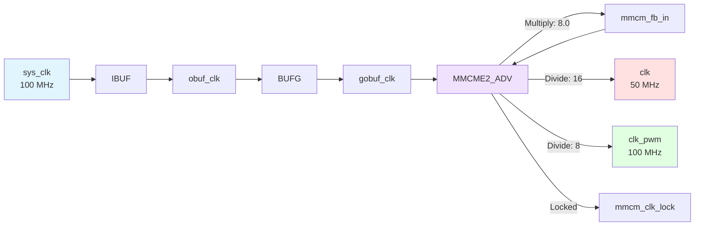
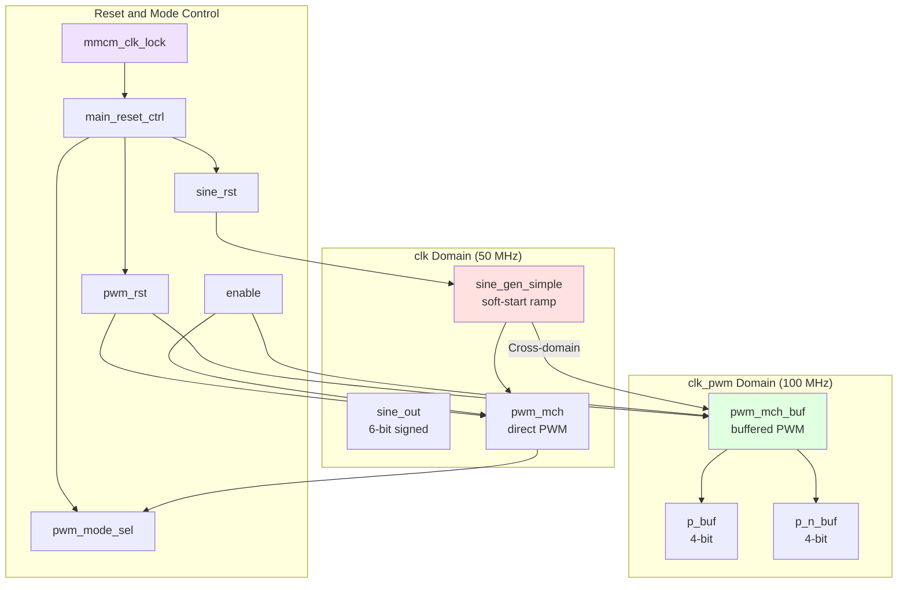
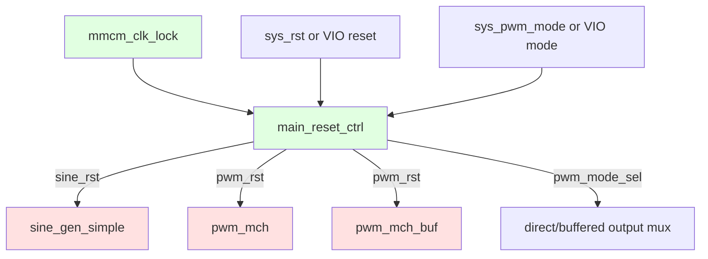
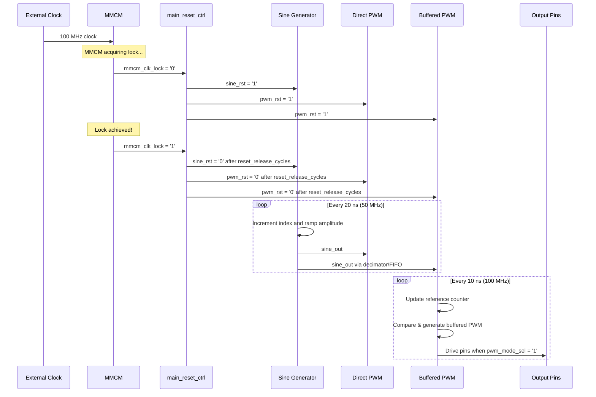

# main.vhd - Top-Level Design

## Overview

The top-level entity `main` orchestrates the entire PWM generation system. It manages clock distribution, sine wave generation, and multi-channel PWM output.

## Block Diagram

```mermaid
graph TB
    subgraph "Top-Level Entity: main"
        direction TB

        subgraph "Clock Input"
            SYS_CLK[sys_clk]
            IBUF[IBUF]
            BUFG[BUFG]
        end

        subgraph "Clock Generation"
            MMCM[MMCME2_ADV]
            FB[Feedback]
        end

        subgraph "Signal Generation Domain"
            SINE[sine_gen_simple<br/>2048 samples, 6-bit<br/>soft-start ramp]
            SINE_OUT[sine_out]
        end

        subgraph "PWM Generation"
            DIRECT[pwm_mch<br/>direct branch]
            PWM[pwm_mch_buf<br/>buffered branch]
            P_BUF[p_buf]
            P_N_BUF[p_n_buf]
            MODE_SEL[mode select<br/>pwm_mode_sel]
        end

        subgraph "Reset / Mode Control"
            CTRL[main_reset_ctrl]
            SINE_RST[sine_rst]
            PWM_RST[pwm_rst]
        end

        subgraph "Output Stage"
            OBUF_P[OBUF × 4]
            OBUF_N[OBUF × 4]
        end
    end

    SYS_CLK --> IBUF --> BUFG --> MMCM
    MMCM -->|clkfbout| FB
    FB --> MMCM
    MMCM -->|clkout1: 50 MHz| SINE
    MMCM -->|clkout1: 50 MHz| DIRECT
    MMCM -->|clkout1: 50 MHz| CTRL
    MMCM -->|clkout2: 100 MHz| PWM
    MMCM -->|locked| CTRL

    SINE -->|sine_out| DIRECT
    SINE -->|sine_out| PWM
    CTRL -->|sine_rst| SINE_RST --> SINE
    CTRL -->|pwm_rst| PWM_RST --> DIRECT
    PWM_RST --> PWM

    DIRECT --> MODE_SEL
    PWM --> P_BUF --> MODE_SEL
    PWM --> P_N_BUF --> MODE_SEL
    MODE_SEL -->|p_selected| OBUF_P
    MODE_SEL -->|p_n_selected| OBUF_N
    OBUF_P --> SYS_PWM[sys_pwm[3:0]]
    OBUF_N --> SYS_PWM_N[sys_pwm_n[3:0]]

    style SYS_CLK fill:#e1f5ff
    style SYS_PWM fill:#ffe1e1
    style SYS_PWM_N fill:#ffe1e1
    style SINE fill:#fff4e1
    style PWM fill:#fff4e1
    style MMCM fill:#f0e1ff
```

## Entity Declaration

```vhdl
entity main is
  generic (
    num_channels                 : integer := 4;           -- Number of PWM channels
    debug                        : string  := "NO_DEBUG";
    pwm_mode_switch_delay_cycles : natural := 25_000_000;  -- Mode handoff blanking delay
    sine_ramp_length             : positive := 2048;       -- Sine soft-start length
    reset_release_cycles         : positive := 5           -- Minimum reset assertion
  );
  port (
    sys_clk      : in    std_logic;    -- System clock input
    sys_rst      : in    std_logic;    -- Board reset request input
    sys_pwm_mode : in    std_logic;    -- Board PWM mode select input
    sys_pwm      : out   std_logic_vector(num_channels - 1 downto 0);
    sys_pwm_n    : out   std_logic_vector(num_channels - 1 downto 0)
  );
end entity main;
```

## Generics

| Generic | Type | Default | Description |
|---------|------|---------|-------------|
| `num_channels` | integer | 4 | Number of PWM output channels (complementary pairs) |
| `debug` | string | "NO_DEBUG" | Optional "DEBUG" build mode that instantiates generated VIO/ILA IP for reset/mode force, override, and output capture |
| `pwm_mode_switch_delay_cycles` | natural | 25,000,000 | Number of `clk` cycles to keep PWM blanked before committing a runtime `sys_pwm_mode` change |
| `sine_ramp_length` | positive | 2048 | Number of `clk` cycles used by `sine_gen_simple` to ramp to full amplitude |
| `reset_release_cycles` | positive | 5 | Minimum synchronized reset assertion length for sine and PWM reset release |

## Ports

| Port | Direction | Width | Description |
|------|-----------|-------|-------------|
| `sys_clk` | in | 1 | External clock input; current board constraints use 100 MHz |
| `sys_rst` | in | 1 | Board reset request input |
| `sys_pwm_mode` | in | 1 | Board PWM mode select input (`0` = direct branch, `1` = buffered branch) |
| `sys_pwm` | out | `num_channels` | PWM outputs (positive) |
| `sys_pwm_n` | out | `num_channels` | PWM outputs (negative/complementary) |

## Internal Constants

```vhdl
constant data_width           : integer   := 6;              -- PWM resolution
constant num_dead_time_cycles : integer   := 4;              -- Dead-time duration
constant buffer_depth         : integer   := 1024;           -- FIFO depth
constant wave_length          : integer   := 2048;           -- Sine table size
constant input_data_type      : string    := "SIGNED";       -- Data format
constant ref_type             : string    := "SYMMETRICAL";  -- PWM mode
constant ref_step             : integer   := 1;              -- Counter increment
constant ref_updwn            : std_logic := '1';            -- Up/down control
constant pwm_idle             : std_logic_vector(num_channels - 1 downto 0) := (others => '0');
```

## Architecture Details

### Clock Tree



### MMCM Configuration

```
┌─────────────────────────────────────────┐
│          MMCME2_ADV Configuration        │
├─────────────────────────────────────────┤
│ clkinsel        = '1'   (use clkin1)    │
│ clkin1_period   = 8.0   (source metadata) │
│ clkin2_period   = 8.0   (unused)        │
│ clkfbout_mult_f = 8.0                    │
│                                         │
│ clkout1_divide  = 16    → 50 MHz with   │
│                         100 MHz sys_clk  │
│ clkout1_phase   = 0.0                   │
│                                         │
│ clkout2_divide  = 8     → 100 MHz with  │
│                         100 MHz sys_clk  │
│ clkout2_phase   = 0.0                   │
└─────────────────────────────────────────┘
```

The checked-in `Z7_LITE.xdc` and `Zybo_board.xdc` constrain `sys_clk` at 10 ns. The implementation timing reports therefore show `clk = 50 MHz` and `clk_pwm = 100 MHz`.

### Data Path



### Reset & Mode Control



**Behavior:**
- `main_reset_ctrl` synchronizes MMCM lock, reset request, and PWM mode request in the `clk` domain.
- MMCM unlock or reset request asserts both `sine_rst` and `pwm_rst` for at least `reset_release_cycles`.
- A runtime PWM mode change asserts only `pwm_rst`, blanks the selected outputs, waits `pwm_mode_switch_delay_cycles`, and then commits `pwm_mode_sel`.
- The sine generator keeps running during PWM mode handoff, so the source waveform phase is not restarted by a direct/buffered switch.

### Output Buffer Stage

```mermaid
graph TB
    P_SELECTED[p_selected] --> OBUF_P0[OBUF]
    P_N_SELECTED[p_n_selected] --> OBUF_N0[OBUF]

    OBUF_P0 --> SYS_PWM[sys_pwm[i]]
    OBUF_N0 --> SYS_PWM_N[sys_pwm_n[i]]

    subgraph "Channel i (0 to 3)"
        P_SELECTED
        P_N_SELECTED
        OBUF_P0
        OBUF_N0
    end

    style P_SELECTED fill:#fff4e1
    style P_N_SELECTED fill:#fff4e1
    style SYS_PWM fill:#ffe1e1
    style SYS_PWM_N fill:#ffe1e1
```

## Operational Sequence



## Signal Details

### Internal Signals

| Signal | Type | Width | Description |
|--------|------|-------|-------------|
| `ibuf_clk` | std_logic | 1 | After input buffer |
| `obuf_clk` | std_logic | 1 | After BUFG input |
| `gobuf_clk` | std_logic | 1 | Global clock to MMCM |
| `mmcm_fb_in` | std_logic | 1 | MMCM feedback |
| `mmcm_clk_lock` | std_logic | 1 | MMCM lock indicator |
| `clk` | std_logic | 1 | System clock (50 MHz in current board builds) |
| `clk_pwm` | std_logic | 1 | PWM clock (100 MHz in current board builds) |
| `sine_rst` | std_logic | 1 | Reset for `sine_gen_simple` |
| `pwm_rst` | std_logic | 1 | Reset and output blanking control for PWM branches |
| `rst_request` | std_logic | 1 | Effective reset request after board/VIO selection |
| `enable` | std_logic | 1 | PWM enable (always '1') |
| `pwm_mode_request` | std_logic | 1 | Effective mode request after board/VIO selection |
| `pwm_mode_sel` | std_logic | 1 | Committed mode select (`0` direct, `1` buffered) |
| `sine_out` | std_logic_vector | 6 | Sine wave output |
| `p_direct`, `p_n_direct` | std_logic_vector | 4 | Direct PWM branch outputs |
| `p_buf` | std_logic_vector | 4 | PWM positive outputs |
| `p_n_buf` | std_logic_vector | 4 | PWM negative outputs |
| `p_selected`, `p_n_selected` | std_logic_vector | 4 | Output-mux result after reset blanking |

## Design Notes

### 1. Clock Buffer Chain

```
sys_clk → IBUF → BUFG → MMCM
```

This chain ensures:
- **IBUF**: Proper I/O buffering for external clock
- **BUFG**: Global clock network for low skew
- **MMCM**: Frequency synthesis and phase alignment

### 2. Unused Components

The following legacy items are not instantiated in the current top:
- `IDELAYCTRL`: I/O delay calibration (not needed for this design)

### 3. Always-Enable Design

The `enable` signal is tied to `'1'`, meaning PWM generation is active once `pwm_rst` is deasserted.

### 4. Complementary Outputs

Each channel produces:
- `sys_pwm[i]`: Positive PWM signal
- `sys_pwm_n[i]`: Complementary (inverted) PWM signal
- Dead-time inserted to prevent shoot-through

## Usage Example

### Instantiation

```vhdl
dut : entity work.main
  generic map (
    num_channels => 4
  )
  port map (
    sys_clk      => clk_100mhz,
    sys_rst      => reset_button,
    sys_pwm_mode => pwm_mode_switch,
    sys_pwm      => pwm_outputs,
    sys_pwm_n    => pwm_outputs_n
  );
```

### Constraints File (XDC)

```tcl
# Clock input (100 MHz)
create_clock -period 10.000 [get_ports sys_clk]

# PWM pins drive off-board loads in the checked-in board constraints.
set_false_path -to [get_ports {sys_pwm[*] sys_pwm_n[*]}]
```

## Timing Information

### Clock Periods

| Clock | Period | Frequency |
|-------|--------|-----------|
| sys_clk | 10.0 ns | 100 MHz |
| clk | 20.0 ns | 50 MHz |
| clk_pwm | 10.0 ns | 100 MHz |

### PWM Characteristics

| Parameter | Value |
|-----------|-------|
| Resolution | 6 bits (64 levels) |
| PWM Frequency | ~781.25 kHz (symmetrical, buffered branch) |
| Modulation | ~24.4 kHz sine LUT rate with current constraints |
| Dead Time | 4 × clk_pwm cycles (~40 ns) |

## See Also

- [Architecture Overview](../architecture/overview.md)
- [PWM Module Documentation](./pwm/README.md)
- [Sine Generator](./signal_chain/README.md)
- [Clock Domain Details](../architecture/clock_domains.md)
