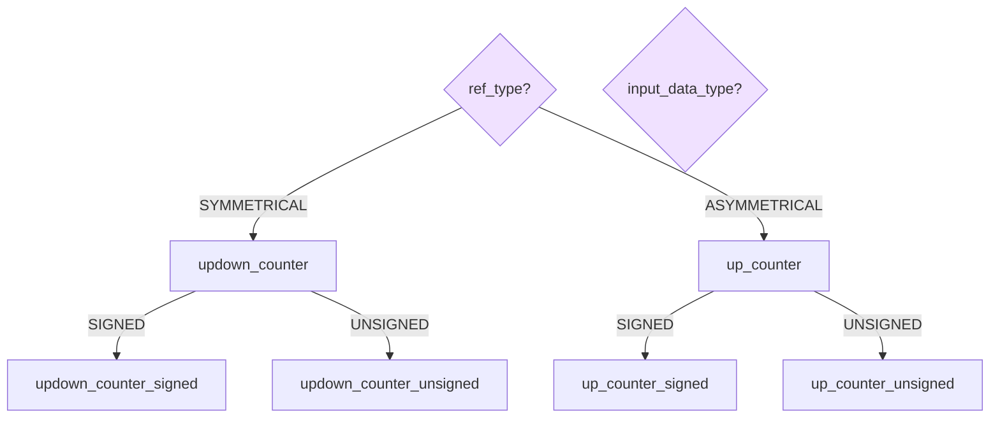
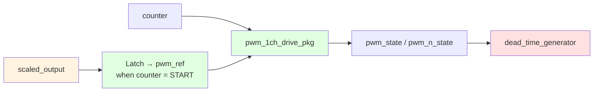
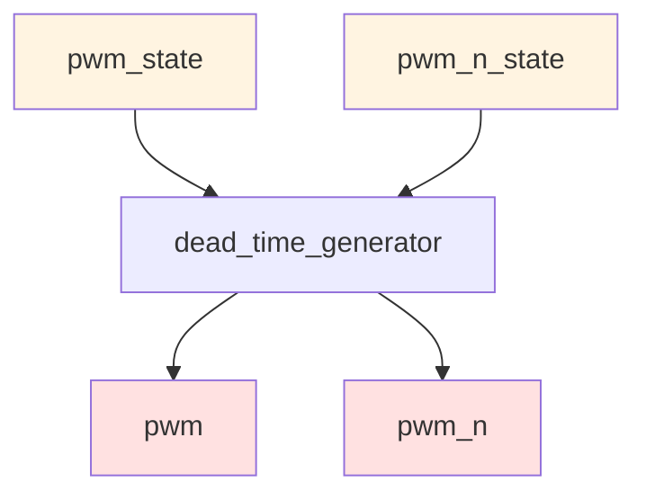
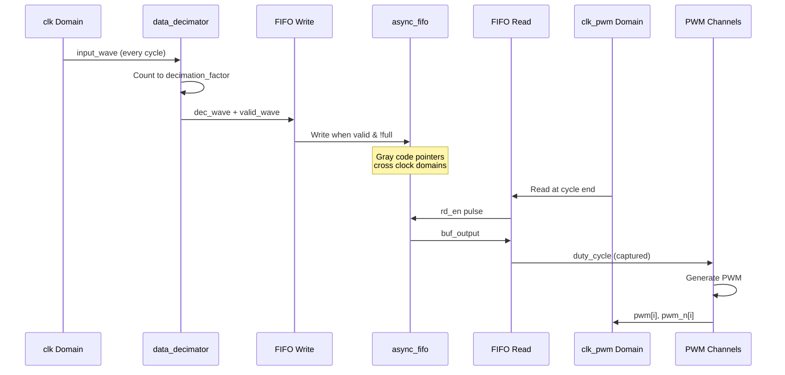
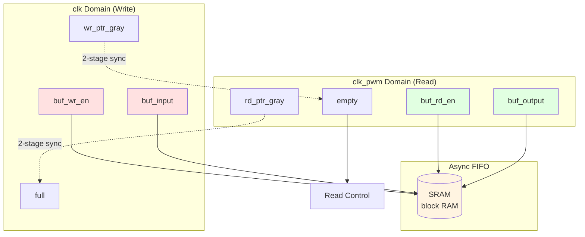
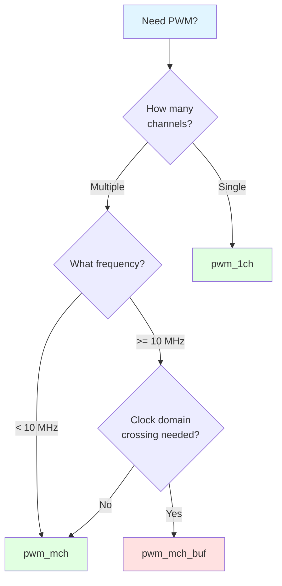

# PWM Modules

## Overview

The PWM generation system consists of:
- **pwm_1ch.vhd**: Single-channel PWM with dead-time control
- **pwm_1ch_drive_pkg.vhd**: Complementary vs bipolar (three-level) pre-drive logic
- **pwm_mch_buf.vhd**: Multi-channel buffered PWM with clock domain crossing
- **pwm_mch.vhd**: Multi-channel direct PWM (non-buffered)

---

## pwm_1ch.vhd - Single Channel PWM

### Block Diagram

```mermaid
graph TB
    subgraph "pwm_1ch Entity"
        direction TB

        CLK[clk]
        RST[rst]
        EN[enable]
        INPUT[input_wave<br/>r-bit]

        subgraph "Input Stage"
            INPUT_REG[Input Register]
        end

        subgraph "Scaler"
            SCALER[scaler_signed<br/>or scaler_unsigned]
            SCALED[scaled_output]
        end

        subgraph "Reference Counter"
            COUNTER{Counter Type?}
            CNT_UP[updown_counter<br/>(SYMMETRICAL)]
            CNT_SAW[up_counter<br/>(ASYMMETRICAL)]
            PWM_REF[pwm_ref]
        end

        subgraph "PWM generation"
            LATCH[Latch scaled_output<br/>at counter = START]
            DRIVE[pwm_1ch_drive_pkg<br/>COMPLEMENTARY or BIPOLAR_SPLIT]
        end

        subgraph "Dead time"
            DT[dead_time_generator<br/>pwm_state / pwm_n_state → outputs]
        end

        PWM[pwm]
        PWM_N[pwm_n]
    end

    CLK --> INPUT_REG
    INPUT --> INPUT_REG
    INPUT_REG --> SCALER
    SCALER --> SCALED

    CLK --> COUNTER
    EN --> COUNTER
    COUNTER --> CNT_UP
    COUNTER --> CNT_SAW
    CNT_UP --> PWM_REF
    CNT_SAW --> PWM_REF

    SCALED --> LATCH
    PWM_REF --> LATCH
    PWM_REF --> DRIVE
    LATCH --> DRIVE
    DRIVE --> DT
    DT --> PWM
    DT --> PWM_N

    style INPUT fill:#e1f5ff
    style PWM fill:#ffe1e1
    style PWM_N fill:#ffe1e1
    style SCALER fill:#fff4e1
    style COUNTER fill:#e1ffe1
```

### Entity Declaration

```vhdl
entity pwm_1ch is
  generic (
    r               : integer   := 7;             -- PWM resolution bits
    input_width     : integer   := 7;             -- Input waveform width
    d               : integer   := 2;             -- Num dead-time cycles
    input_data_type : string    := "SIGNED";      -- SIGNED, UNSIGNED, FP23, FP23_SIGNED
    ref_type        : string    := "SYMMETRICAL"; -- Symmetrical or Asymmetrical
    output_mode     : string    := "COMPLEMENTARY"; -- COMPLEMENTARY or BIPOLAR_SPLIT
    scale_factor    : real      := 0.8;
    offset_factor   : real      := 0.1;
    fp23_binary_point : integer := 6;
    ref_init        : integer   := 0;
    ref_step        : integer   := 1;
    ref_updwn       : std_logic := '1'
  );
  port (
    clk        : in    std_logic;
    rst        : in    std_logic;
    enable     : in    std_logic;
    input_wave : in    std_logic_vector(input_width - 1 downto 0);
    pwm        : out   std_logic;
    pwm_n      : out   std_logic
  );
end entity pwm_1ch;
```

### Generics

| Generic | Type | Default | Description |
|---------|------|---------|-------------|
| `r` | integer | 7 | PWM resolution in bits |
| `input_width` | integer | 7 | Input waveform width; use 23 for FP23 inputs |
| `d` | integer | 2 | Number of dead-time clock cycles |
| `input_data_type` | string | "SIGNED" | Data format: "SIGNED", "UNSIGNED", "FP23", or "FP23_SIGNED" |
| `ref_type` | string | "SYMMETRICAL" | Reference type: "SYMMETRICAL" or "ASYMMETRICAL" |
| `output_mode` | string | "COMPLEMENTARY" | "COMPLEMENTARY" (pwm_n ≈ not pwm) or "BIPOLAR_SPLIT" (three-level; see below) |
| `scale_factor` | real | 0.8 | Amplitude scaling factor |
| `offset_factor` | real | 0.1 | DC offset factor |
| `fp23_binary_point` | integer | 6 | Binary-point placement used when converting packed FP23 input to the signed PWM reference domain |
| `ref_init` | integer | 0 | Counter initial value |
| `ref_step` | integer | 1 | Counter increment value |
| `ref_updwn` | std_logic | '1' | Up/down control ('1'=up, '0'=down) |

### Ports

| Port | Direction | Width | Description |
|------|-----------|-------|-------------|
| `clk` | in | 1 | Clock input |
| `rst` | in | 1 | Active-high reset |
| `enable` | in | 1 | Enable signal |
| `input_wave` | in | `input_width` | Input waveform value |
| `pwm` | out | 1 | PWM high-side (or positive-half) command after dead time |
| `pwm_n` | out | 1 | PWM low-side (or negative-half) command after dead time; meaning depends on `output_mode` |

### Internal Architecture

#### 1. Counter Selection Logic



#### 2. Reference latch and drive functions

On each rising edge of `clk`, when `counter` equals the period **START** value, `pwm_ref` samples `scaled_output`. The pre-drive legs `pwm_state` / `pwm_n_state` come from **`pwm_1ch_drive_pkg`**:

- **`drive_complementary_*`**: same compare as classic PWM; `pwm_n_state = not pwm_state`.
- **`drive_bipolar_signed`**: neutral at 0 — only `pwm` pulses for positive `pwm_ref`, only `pwm_n` for negative `pwm_ref`, both off at zero.
- **`drive_bipolar_unsigned`**: neutral at **`2**(r-1)`** — same idea on offset samples vs midpoint.



#### 3. Dead-Time Control



**Dead-Time Waveform:**

```
pwm_state:    ────────┐              ┌──────────────────────
                      │              │
                      │              │
                      └──────────────┘

                      ◄── dead_time ─►
pwm output:     ──────┐              ┌──────────────────────
                      │              │
                      │              │
                      └──────────────┘


pwm_n_state:    ┌──────────────────────────────────────┐
                │                                      │
                └──────────────────────────────────────┘

                                   ◄── dead_time ──►
pwm_n output:   ┌─────────────────┐              ┌────
                │                 │              │
                └─────────────────┘              └────

                ◄──── dead_time (BOTH edges delayed) ────►
```

**CRITICAL SAFETY FEATURE:**
- ✅ **Rising edges delayed**: Prevents turn-on until complementary signal is OFF + dead_time
- ✅ **Falling edges delayed**: Ensures complementary signal stays OFF for dead_time
- ✅ **Both edges delayed**: Guarantees no shoot-through in power stage
- ⚠️ **PREVIOUS BUG**: Old implementation only delayed rising edges, allowing shoot-through

### Operation Modes

#### Symmetrical PWM (Triangle Reference)

```
Reference Counter:
    
    ▲
    │     /\
    │    /  \
    │   /    \
    │  /      \
    │ /        \
    └──────────────────► time
   START        STOP

Comparator (COMPLEMENTARY mode):
    if (counter < pwm_ref) then
        pwm_state = '1'
    else
        pwm_state = '0'
    end if
    pwm_n_state = not pwm_state   -- before dead_time_generator
```

For **BIPOLAR_SPLIT**, the carrier and latch are unchanged; leg rules are described in [BIPOLAR_SPLIT](#bipolar_split-three-level) and in **`pwm_1ch_drive_pkg`**.

#### Asymmetrical PWM (Sawtooth Reference)

```
Reference Counter:
    
    ▲
    │     /|
    │    / |
    │   /  |
    │  /   |
    │ /    |
    └──────────────────► time
   START  STOP
   (reset)
```

#### BIPOLAR_SPLIT (three-level)

Uses the **same** reference counter and `pwm_ref` latch as complementary mode; only the compare rules in **`pwm_1ch_drive_pkg`** change.

**SIGNED** (neutral = 0):

- `pwm_ref > 0`: `pwm_state` follows `counter < pwm_ref`; `pwm_n_state = '0'`.
- `pwm_ref < 0`: `pwm_n_state` follows `counter > pwm_ref`; `pwm_state = '0'`.
- `pwm_ref = 0`: both legs off.

**UNSIGNED** (neutral = `2**(r-1)`): same structure on offset samples  
`to_integer(unsigned(x)) - 2**(r-1)` for `counter` and `pwm_ref`.

### Key Design Features

1. **Cycle-aligned latching**: `scaled_output` captured at counter START each PWM frame
2. **Drive package**: Shared combinational functions for complementary vs bipolar leg generation
3. **Dead-time insertion**: `dead_time_generator` on both legs
4. **Flexible configuration**: Signed/unsigned, symmetrical/asymmetrical, complementary or bipolar split

---

## pwm_1ch_drive_pkg.vhd - Pre-drive leg generation

Pure VHDL **package** (no entity). Used only from `pwm_1ch.vhd` to keep the main architecture readable.

| Function | Role |
|----------|------|
| `drive_complementary_signed` / `drive_complementary_unsigned` | Classic PWM: one compare, complementary legs |
| `drive_bipolar_signed` / `drive_bipolar_unsigned` | Three-level split: mutually exclusive legs around neutral (0 or `2**(r-1)`) |

Return type is **`pwm_leg_pair`** (`pwm`, `pwm_n`), i.e. the signals fed into **`dead_time_generator`**.

---

## pwm_mch_buf.vhd - Multi-Channel Buffered PWM

### Block Diagram

```mermaid
graph TB
    subgraph "pwm_mch_buf Entity"
        direction TB

        CLK[clk]
        CLK_PWM[clk_pwm]
        RST[rst]
        EN[enable]
        INPUT[input_wave<br/>r-bit]

        subgraph "Decimation Stage"
            DEC[data_decimator]
            DEC_WAVE[dec_wave]
            VALID_WAVE[valid_wave]
        end

        subgraph "Clock Domain Crossing"
            FIFO_WR[async_fifo<br/>Write Side (clk)]
            FIFO_RD[async_fifo<br/>Read Side (clk_pwm)]
            BUF_FULL[full]
            BUF_EMPTY[empty]
        end

        subgraph "Write Control (clk)"
            WR_CTRL[Input Buffer<br/>Write Control]
        end

        subgraph "Read Control (clk_pwm)"
            RD_CTRL[Input Buffer<br/>Read Control]
        end

        subgraph "Duty Cycle Capture (clk_pwm)"
            CAPTURE[pwm_reg_ctrl]
            DUTY[duty_cycle<br/>r-bit]
        end

        subgraph "PWM Channels"
            GEN{Channel Generator}

            CH0[pwm_1ch #0]
            CH1[pwm_1ch #1]
            CHN[pwm_1ch #N]

            PWM0[pwm[0]]
            PWM0_N[pwm_n[0]]
            PWM1[pwm[1]]
            PWM1_N[pwm_n[1]]
            PWMN[pwm[N]]
            PWMN_N[pwm_n[N]]
        end

        PWM[pwm outputs]
        PWM_N[pwm_n outputs]
    end

    CLK --> DEC
    INPUT --> DEC
    DEC --> VALID_WAVE
    VALID_WAVE --> WR_CTRL
    DEC_WAVE --> WR_CTRL

    WR_CTRL --> FIFO_WR
    FIFO_WR -.->|Gray Code| FIFO_RD

    CLK_PWM --> RD_CTRL
    BUF_EMPTY --> RD_CTRL
    RD_CTRL --> FIFO_RD
    FIFO_RD --> CAPTURE
    CAPTURE --> DUTY

    DUTY --> CH0
    DUTY --> CH1
    DUTY --> CHN

    CH0 --> PWM0
    CH0 --> PWM0_N
    CH1 --> PWM1
    CH1 --> PWM1_N
    CHN --> PWMN
    CHN --> PWMN_N

    style INPUT fill:#e1f5ff
    style PWM fill:#ffe1e1
    style PWM_N fill:#ffe1e1
    style FIFO_WR fill:#fff4e1
    style FIFO_RD fill:#e1ffe1
```

### Entity Declaration

```vhdl
entity pwm_mch_buf is
  generic (
    r               : integer   := 7;             -- PWM resolution bits
    d               : integer   := 2;             -- Num dead-time cycles
    num_channels    : integer   := 2;             -- Number of channels
    input_data_type : string    := "SIGNED";      -- SIGNED, UNSIGNED, FP23, FP23_SIGNED
    buffer_depth    : integer   := 1024;          -- FIFO depth
    ref_type        : string    := "SYMMETRICAL"; -- Symmetrical or Asymmetrical
    output_mode     : string    := "COMPLEMENTARY"; -- Passed to each pwm_1ch
    ref_step        : integer   := 1;             -- Counter increment
    ref_updwn       : std_logic := '1';           -- Up/down control
    -- CRITICAL: Clock frequencies for proper decimation calculation
    clk_freq_hz     : integer   := 100_000_000;   -- Input clock frequency (clk domain)
    clk_pwm_freq_hz : integer   := 200_000_000    -- PWM clock frequency (clk_pwm domain)
  );
  port (
    clk        : in    std_logic;
    clk_pwm    : in    std_logic;
    rst        : in    std_logic;
    enable     : in    std_logic;
    input_wave : in    std_logic_vector(r - 1 downto 0);
    pwm        : out   std_logic_vector(num_channels - 1 downto 0);
    pwm_n      : out   std_logic_vector(num_channels - 1 downto 0)
  );
end entity pwm_mch_buf;
```

### Data Flow



### Clock Domain Crossing



### FIFO Control Logic

#### Write Control (clk domain)

```vhdl
if (buf_full = '0' and valid_wave = '1') then
    buf_wr_en <= '1';
    buf_input <= dec_wave;
else
    buf_wr_en <= '0';
end if;
```

#### Read Control (clk_pwm domain)

```vhdl
-- Cycle length depends on PWM mode
if (ref_type = "SYMMETRICAL") then
    cycle_length := 2^(r+1);  -- 128 for r=6
else
    cycle_length := 2^r;      -- 64 for r=6
end if;

-- Read at end of each PWM frame when FIFO has data.
if (rst_pwm = '1') then
    cnt := 0;
    buf_rd_en <= '0';
    buf_rd_valid <= '0';
elsif (cnt = cycle_length - 1) then
    cnt := 0;
    buf_rd_valid <= buf_rd_en;

    if (buf_empty = '0') then
        buf_rd_en <= '1';
    else
        buf_rd_en <= '0';
    end if;
else
    buf_rd_en <= '0';
    buf_rd_valid <= buf_rd_en;
    cnt := cnt + 1;
end if;
```

### Channel Generation

```mermaid
graph TB
    DUTY[duty_cycle<br/>r-bit] --> GEN{range_divider_pkg<br/>get_chunk_end}

    GEN -->|chunk[0]| INIT0[ref_init=chunk0.val<br/>ref_updwn=chunk0.flag]
    GEN -->|chunk[1]| INIT1[ref_init=chunk1.val<br/>ref_updwn=chunk1.flag]
    GEN -->|chunk[N]| INITN[ref_init=chunkN.val<br/>ref_updwn=chunkN.flag]

    DUTY --> CH0[pwm_1ch #0]
    DUTY --> CH1[pwm_1ch #1]
    DUTY --> CHN[pwm_1ch #N]

    INIT0 --> CH0
    INIT1 --> CH1
    INITN --> CHN

    CH0 --> PWM0[pwm[0], pwm_n[0]]
    CH1 --> PWM1[pwm[1], pwm_n[1]]
    CHN --> PWMN[pwm[N], pwm_n[N]]

    style DUTY fill:#fff4e1
    style PWM0 fill:#ffe1e1
    style PWM1 fill:#ffe1e1
    style PWMN fill:#ffe1e1
```

### Decimation Factor

**CRITICAL: The decimation factor must be calculated based on actual clock frequencies to prevent FIFO overflow/underflow.**

#### Formula

```
For SYMMETRICAL mode:
    pwm_cycle_length = 2^(r+1)
    decimation_factor_real = (clk_freq_hz * pwm_cycle_length) / clk_pwm_freq_hz
    decimation_factor = round(decimation_factor_real * 0.95)

For ASYMMETRICAL mode:
    pwm_cycle_length = 2^r
    decimation_factor_real = (clk_freq_hz * pwm_cycle_length) / clk_pwm_freq_hz
    decimation_factor = round(decimation_factor_real * 0.95)
```

#### Examples

**Example 1: Equal clocks (clk = clk_pwm = 100MHz), SYMMETRICAL, r=7**
```
pwm_cycle_length = 2^8 = 256
decimation_factor_real = (100e6 * 256) / 100e6 = 256
decimation_factor = round(256 * 0.95) = 243
→ Write every 243 clk cycles, read every 256 clk_pwm cycles
```

**Example 2: Faster input clock (clk=200MHz, clk_pwm=100MHz), SYMMETRICAL, r=7**
```
pwm_cycle_length = 2^8 = 256
decimation_factor_real = (200e6 * 256) / 100e6 = 512
decimation_factor = round(512 * 0.95) = 486
→ Write every 486 clk cycles, read every 256 clk_pwm cycles
```

**Current top-level ratio (clk=50MHz, clk_pwm=100MHz), SYMMETRICAL, r=6**
```
pwm_cycle_length = 2^7 = 128
decimation_factor_real = (50e6 * 128) / 100e6 = 64
decimation_factor = round(64 * 0.95) = 61
```

#### Safety Margin

The implementation applies a **5% safety margin** to ensure write rate > read rate:
```vhdl
decimation_factor = round(decimation_factor_real * 0.95)
```

This prevents FIFO underflow due to:
- Clock drift
- Phase differences
- Jitter

#### Configuration

You **MUST** set the clock frequency generics to match your hardware:

```vhdl
pwm_mch_buf_inst : entity work.pwm_mch_buf
  generic map (
    r               => 7,
    num_channels    => 2,
    ref_type        => "SYMMETRICAL",
    output_mode     => "COMPLEMENTARY",  -- or "BIPOLAR_SPLIT"
    clk_freq_hz     => 50_000_000,    -- Your clk frequency
    clk_pwm_freq_hz => 100_000_000    -- Your clk_pwm frequency
  )
  port map (
    ...
  );
```

⚠️ **PREVIOUS BUG**: Old implementation used `decimation_factor = pwm_cycle_length / 2`, which completely ignored clock frequencies and would cause FIFO overflow/underflow in most configurations.

---

## pwm_mch.vhd - Multi-Channel Direct PWM

### Overview

Simplified version without buffering. All channels share the same clock domain. The current top-level `main.vhd` instantiates this as the direct branch selected when `sys_pwm_mode = '0'`.

### Block Diagram

```mermaid
graph TB
    CLK[clk]
    RST[rst]
    EN[enable]
    INPUT[input_wave]

    GEN{range_divider_pkg}

    CH0[pwm_1ch #0]
    CH1[pwm_1ch #1]
    CHN[pwm_1ch #N]

    PWM0[pwm[0], pwm_n[0]]
    PWM1[pwm[1], pwm_n[1]]
    PWMN[pwm[N], pwm_n[N]]

    CLK --> CH0
    CLK --> CH1
    CLK --> CHN

    INPUT --> CH0
    INPUT --> CH1
    INPUT --> CHN

    GEN -->|chunk[0]| CH0
    GEN -->|chunk[1]| CH1
    GEN -->|chunk[N]| CHN

    CH0 --> PWM0
    CH1 --> PWM1
    CHN --> PWMN

    style INPUT fill:#e1f5ff
    style PWM0 fill:#ffe1e1
    style PWM1 fill:#ffe1e1
    style PWMN fill:#ffe1e1
```

### Key Differences from pwm_mch_buf

| Feature | pwm_mch | pwm_mch_buf |
|---------|---------|-------------|
| Clock domains | Single | Dual (clk + clk_pwm) |
| Buffering | None | async_fifo |
| Decimation | None | data_decimator |
| `output_mode` | Yes (per-channel `pwm_1ch`) | Yes (forwarded to each `pwm_1ch`) |
| Timing | Critical path | Relaxed via FIFO |
| Use case | Low frequency | High frequency |

---

## Comparison & Usage

### When to Use Each Module

| Module | Use Case | Max Frequency | Complexity |
|--------|----------|---------------|------------|
| `pwm_1ch` | Single channel | High | Low |
| `pwm_mch` | Multi-channel, low freq | Medium | Medium |
| `pwm_mch_buf` | Multi-channel, high freq | High | High |

### Module Selection Guide



## See Also

- [Counter Modules](../counters/README.md)
- [Signal chain / scalers](../signal_chain/README.md)
- [Dead time / utilities](../utils/README.md) (`dead_time_generator`)
- [Async FIFO](../buffers/README.md)

### Testbenches

- `tb/tb_pwm_1ch.vhd` — two instances: **COMPLEMENTARY** vs **BIPOLAR_SPLIT**, shared sine
- `tb/tb_pwm_mch.vhd` — same for `pwm_mch` and `pwm_mch_buf` (four DUTs total)
