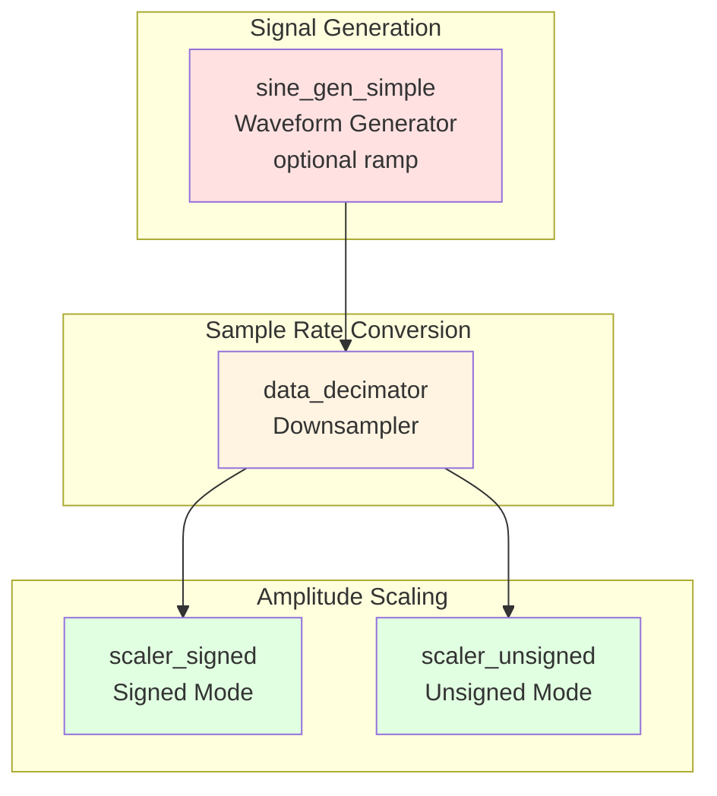
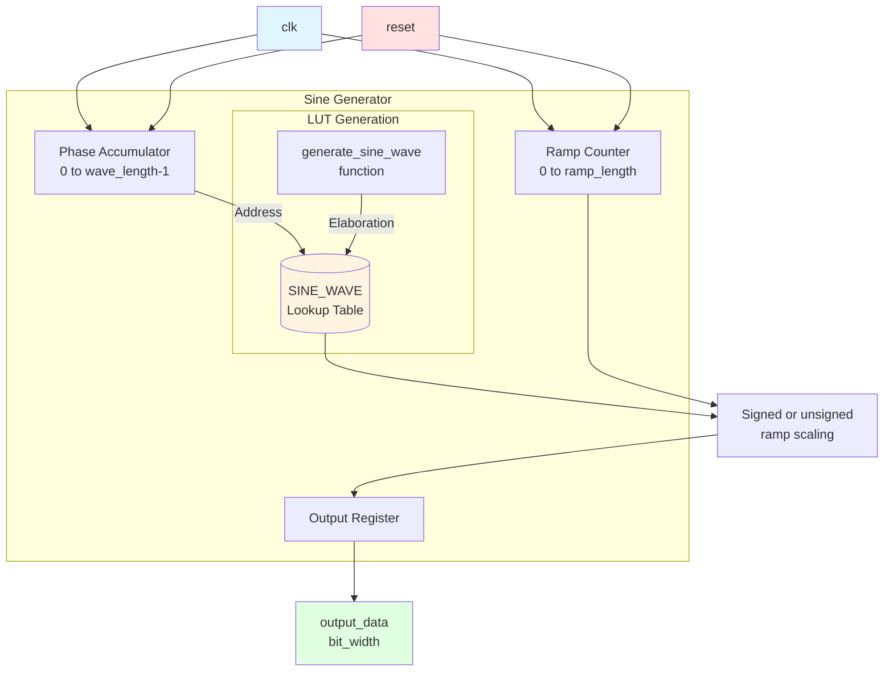
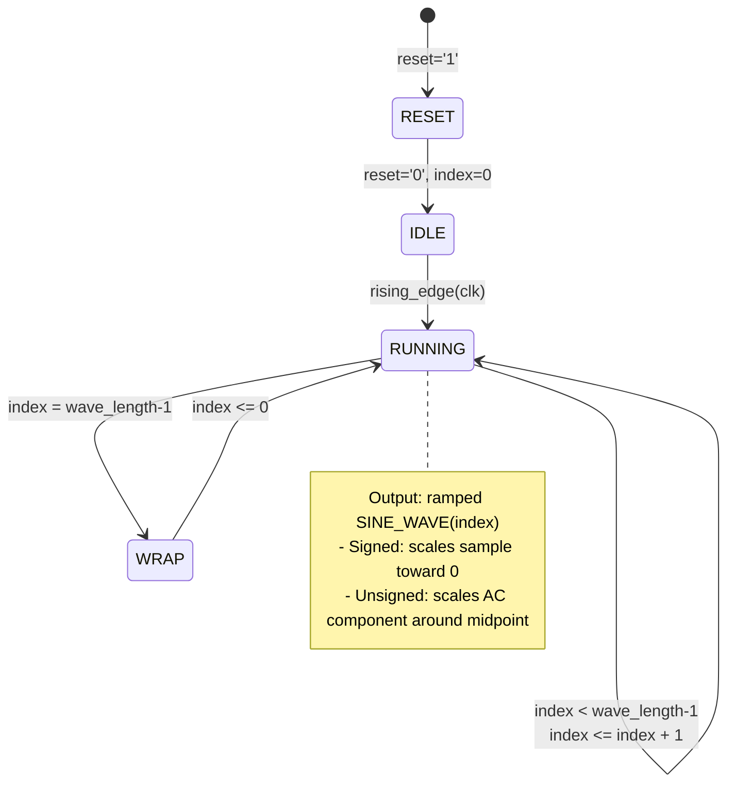
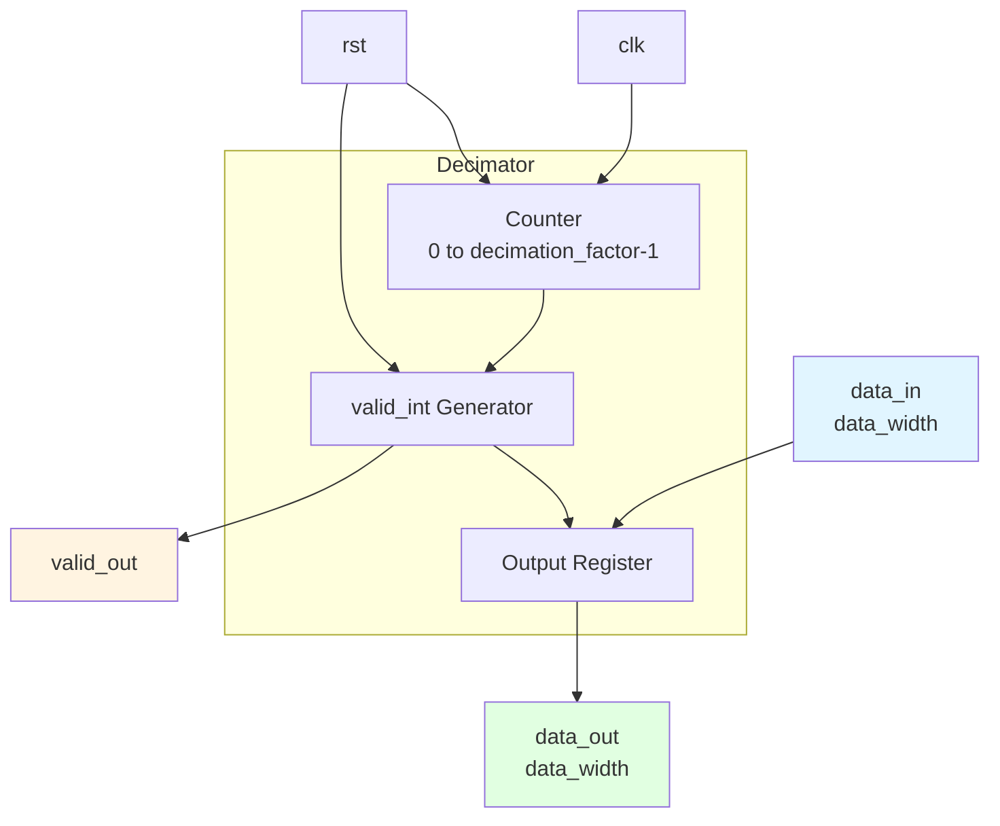
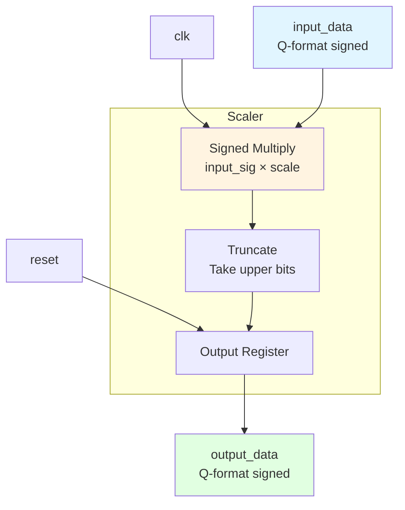
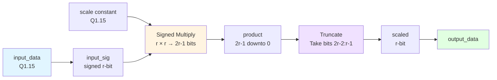
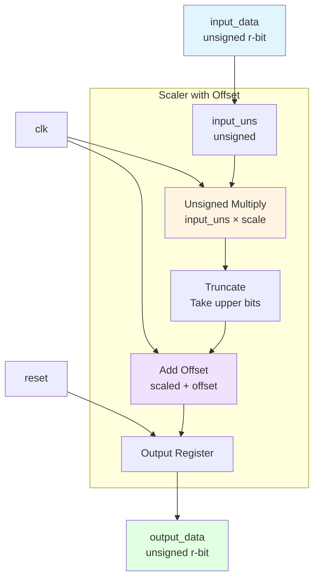
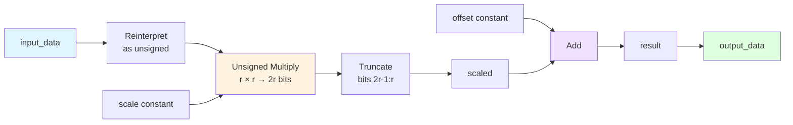
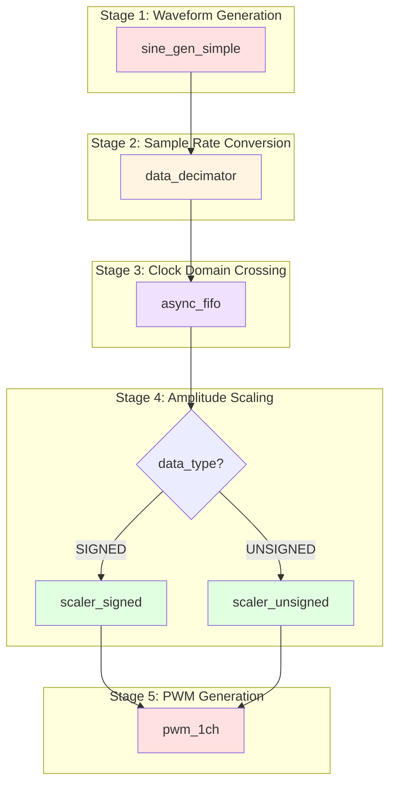

# Signal Chain Modules

## Overview

The signal chain modules handle waveform generation, scaling, and sample rate conversion:

- **sine_gen_simple.vhd**: Sine wave lookup table generator with optional soft-start ramp
- **data_decimator.vhd**: Sample rate decimator (downsampler)
- **scaler_signed.vhd**: Signed amplitude scaler
- **scaler_unsigned.vhd**: Unsigned amplitude scaler with offset

## Module Hierarchy



---

## sine_gen_simple.vhd - Sine Wave Generator

### Description

Generates a continuous sine wave using a lookup table (LUT) approach with elaboration-time computed constants. When enabled, the ramp logic fades the waveform amplitude in after reset.

### Block Diagram



### Entity Declaration

```vhdl
entity sine_gen_simple is
  generic (
    wave_length : positive := 1024;      -- Samples per full cycle
    bit_width   : positive := 16;        -- Output bit width
    data_type   : string   := "UNSIGNED"; -- "UNSIGNED" or "SIGNED"
    ramp_enable : boolean  := false;
    ramp_length : natural  := 0
  );
  port (
    clk         : in    std_logic;
    reset       : in    std_logic;
    output_data : out   std_logic_vector(bit_width - 1 downto 0)
  );
end entity sine_gen_simple;
```

### Generics

| Generic | Type | Default | Description |
|---------|------|---------|-------------|
| `wave_length` | positive | 1024 | Number of samples per sine cycle |
| `bit_width` | positive | 16 | Output resolution in bits |
| `data_type` | string | "UNSIGNED" | Output format: "SIGNED" or "UNSIGNED" |
| `ramp_enable` | boolean | false | Enables post-reset amplitude ramp |
| `ramp_length` | natural | 0 | Ramp length in `clk` cycles; `0` uses `wave_length` |

### Ports

| Port | Direction | Width | Description |
|------|-----------|-------|-------------|
| `clk` | in | 1 | Clock input |
| `reset` | in | 1 | Active-high reset |
| `output_data` | out | bit_width | Sine wave sample output |

### LUT Generation Algorithm

```mermaid
graph TB
    START[generate_sine_wave]
    
    subgraph "For each index i"
        ANGLE[Calculate angle<br/>θ = i × 2π / wave_length]
        SIN[Compute sine<br/>sin_val = sin(θ)]
        
        subgraph "Data Type Selection"
            TYPE{data_type?}
            SIGNED_MAP[Signed Mapping<br/>scaled = sin_val × 2^(N-1)-1]
            UNSIGNED_MAP[Unsigned Mapping<br/>scaled = sin_val+1 / 2 × 2^N-1]
        end
        
        CONVERT[Convert to signed<br/>to_signed(int_val, N)]
    end

    WAVE[Return wave_array]

    START --> ANGLE --> SIN --> TYPE
    TYPE -->|SIGNED| SIGNED_MAP
    TYPE -->|UNSIGNED| UNSIGNED_MAP
    SIGNED_MAP --> CONVERT
    UNSIGNED_MAP --> CONVERT
    CONVERT --> WAVE

    style START fill:#f0e1ff
    style WAVE fill:#e1ffe1
    style TYPE fill:#fff4e1
```

### Data Type Mapping

#### Signed Mode

```
sin_val range: [-1.0, +1.0]
Output range:  [-2^(N-1), 2^(N-1)-1]

Example (N=6):
    sin_val = -1.0  →  -32
    sin_val =  0.0  →    0
    sin_val = +1.0  →   +31
```

```
    ▲ output_data
    │
 31 ┤        ╭─────╮
    │      ╭─╯     ╰─╮
    │    ╭─╯         ╰─╮
    │  ╭╯               ╰╮
  0 ┤──╯                 ╰──
    │ ╭╮               ╭╮
    │  ╰╮               ╭╯
-32 ┤    ╰─────────────╯
    │
    └──────────────────────────────► index
    0          1024         2048
```

#### Unsigned Mode

```
sin_val range: [-1.0, +1.0]
Output range:  [0, 2^N-1]

Example (N=6):
    sin_val = -1.0  →    0
    sin_val =  0.0  →   32
    sin_val = +1.0  →   63
```

```
    ▲ output_data
    │
 63 ┤        ╭─────╮
    │      ╭─╯     ╰─╮
    │    ╭─╯         ╰─╮
    │  ╭╯               ╰╮
 32 ┤──╯                 ╰──
    │ ╭╮               ╭╮
    │  ╰╮               ╭╯
  0 ┤    ╰─────────────╯
    │
    └──────────────────────────────► index
    0          1024         2048
```

### Operation



### Soft-Start Ramp

With `ramp_enable = true`, `ramp_count` increments once per `clk` until the effective ramp length is reached. Signed output multiplies each sample by `ramp_count / ramp_length`, so the waveform starts at zero amplitude. Unsigned output preserves the midpoint and scales only the AC component, so the first active unsigned sample starts near midscale rather than rail zero.

In the current top-level build, `main.vhd` enables the ramp and passes `sine_ramp_length` with a default of 2048 cycles.

### Usage Example

```vhdl
-- In main.vhd:
dut_sine : entity work.sine_gen_simple
  generic map (
    wave_length => 2048,           -- 2048 samples
    bit_width   => 6,              -- 6-bit output
    data_type   => "SIGNED",       -- Signed output
    ramp_enable => true,
    ramp_length => 2048
  )
  port map (
    clk         => clk,            -- 50 MHz in current board builds
    reset       => sine_rst,
    output_data => sine_out        -- 6-bit sine wave
  );
```

### Resource Usage

| Resource | Estimate | Notes |
|----------|----------|-------|
| Block RAM | 1 | For 2048×6 LUT |
| LUTs | ~10 | Index logic |
| FFs | ~10 | Pipeline registers |

---

## data_decimator.vhd - Sample Rate Decimator

### Description

Reduces the sample rate by an integer factor, outputting one sample every N input samples.

### Block Diagram



### Entity Declaration

```vhdl
entity data_decimator is
  generic (
    data_width        : integer := 16;  -- Width of input data
    decimation_factor : integer := 100  -- Rate reduction factor
  );
  port (
    clk       : in    std_logic;
    rst       : in    std_logic;
    data_in   : in    std_logic_vector(data_width - 1 downto 0);
    data_out  : out   std_logic_vector(data_width - 1 downto 0);
    valid_out : out   std_logic
  );
end entity data_decimator;
```

### Generics

| Generic | Type | Default | Description |
|---------|------|---------|-------------|
| `data_width` | integer | 16 | Input/output data width |
| `decimation_factor` | integer | 100 | Output rate = input_rate / factor |

### Ports

| Port | Direction | Width | Description |
|------|-----------|-------|-------------|
| `clk` | in | 1 | Clock input |
| `rst` | in | 1 | Active-high reset |
| `data_in` | in | data_width | High-rate input stream |
| `data_out` | out | data_width | Decimated output stream |
| `valid_out` | out | 1 | Pulse when new sample valid |

### Operation Timing

```
Input: 100 MHz
Decimation Factor: 100
Output: 1 MHz
```

```mermaid
gantt
    title Decimator Timing Diagram (factor=4 example)
    dateFormat X
    axisFormat %t
    
    section Clock
    clk          :0, 1, 2, 3, 4, 5, 6, 7, 8
    
    section Counter
    count_reg    :0, 1, 2, 3, 0, 1, 2, 3, 0
    
    section Output
    valid_out    :crit, 0, 0, 0, 1, 0, 0, 0, 1, 0
    data_out     :crit, -, -, -, d0, -, -, -, d1, -
```

### Text Timing Diagram

```
Clock:       ─┐ ┌─┐ ┌─┐ ┌─┐ ┌─┐ ┌─┐ ┌─┐ ┌─┐ ┌─
             └─┘ └─┘ └─┘ └─┘ └─┘ └─┘ └─┘ └─┘

count_reg:   0   1   2   3   0   1   2   3   0
                                     (factor=4)

valid_out:   0   0   0   1   0   0   0   1   0
                     ▲               ▲
                   sample          sample

data_out:    -   -   -  d0   -   -   -  d1   -
```

### Algorithm

```vhdl
process (clk, rst) is
begin
  if rst = '1' then
    count_reg <= 0;
    valid_int <= '0';
    data_out  <= (others => '0');
  elsif rising_edge(clk) then
    valid_int <= '0';  -- Default: not valid

    if count_reg = decimation_factor - 1 then
      count_reg <= 0;
      valid_int <= '1';           -- Pulse valid for 1 cycle
      data_out  <= data_in;       -- Capture current input
    else
      count_reg <= count_reg + 1;
    end if;
  end if;
end process;
```

### Usage in PWM System

```vhdl
-- In pwm_mch_buf.vhd:
dec_sine : entity work.data_decimator
  generic map (
    data_width        => r,              -- PWM resolution
    decimation_factor => decimation_factor
  )
  port map (
    clk       => clk,
    rst       => rst,
    data_in   => input_wave,             -- From sine generator
    data_out  => dec_wave,               -- Decimated output
    valid_out => valid_wave              -- Valid pulse
  );
```

### Decimation Factor Calculation

```
For SYMMETRICAL PWM:
    pwm_cycle_length = 2^(r+1)
    decimation_real = (clk_freq_hz * pwm_cycle_length) / clk_pwm_freq_hz
    decimation = round(decimation_real * 0.95)
    
    Current top-level ratio (r=6, clk:clk_pwm = 50:100 MHz):
    decimation_real = (50 MHz * 128) / 100 MHz = 64
    decimation = round(64 * 0.95) = 61
    
For ASYMMETRICAL PWM:
    pwm_cycle_length = 2^r
    decimation_real = (clk_freq_hz * pwm_cycle_length) / clk_pwm_freq_hz
    decimation = round(decimation_real * 0.95)
    
    Same clock ratio, r=6:
    decimation_real = (50 MHz * 64) / 100 MHz = 32
    decimation = round(32 * 0.95) = 30
```

---

## scaler_signed.vhd - Signed Amplitude Scaler

### Description

Scales signed input data by a fixed factor using fixed-point multiplication.

### Block Diagram



### Entity Declaration

```vhdl
entity scaler_signed is
  generic (
    r            : integer := 16;   -- Data width
    scale_factor : real    := 0.9   -- Scaling factor
  );
  port (
    clk         : in    std_logic;
    reset       : in    std_logic;
    input_data  : in    std_logic_vector(r - 1 downto 0);
    output_data : out   std_logic_vector(r - 1 downto 0)
  );
end entity scaler_signed;
```

### Generics

| Generic | Type | Default | Description |
|---------|------|---------|-------------|
| `r` | integer | 16 | Data width in bits |
| `scale_factor` | real | 0.9 | Multiplication factor (0.0 to 1.0) |

### Ports

| Port | Direction | Width | Description |
|------|-----------|-------|-------------|
| `clk` | in | 1 | Clock input |
| `reset` | in | 1 | Active-high reset |
| `input_data` | in | r | Signed input (Q1.N-1 format) |
| `output_data` | out | r | Scaled signed output |

### Multiplication Algorithm



### Fixed-Point Format

```
Input:  Q1.15 format (1 sign bit, 15 fraction bits)
        Range: -1.0 to +0.99997

Scale:  Q1.15 format
        Example: 0.9 → 29491 (0.9 × 32768)

Output: Q1.15 format
        Range: -0.9 to +0.89997
```

### Example Calculation

```
For r=16, scale_factor=0.9:

Input:    0.5 (in Q1.15: 0.5 × 32768 = 16384)
Scale:    0.9 (in Q1.15: 0.9 × 32768 = 29491)

Multiply: 16384 × 29491 = 483,180,544
          = 0x1CD0_0000 (32-bit result)

Truncate: Take bits [30:15]
          = 0x3999 (16-bit result)
          = 14745 decimal

Output:   14745 / 32768 = 0.45 (≈ 0.5 × 0.9) ✓
```

### Operation

```vhdl
process (clk, reset) is
begin
  if reset = '1' then
    output_data <= (others => '0');
  elsif rising_edge(clk) then
    -- Signed multiplication: 16 × 16 → 32 bits
    product <= input_sig * scale;

    -- Divide by 32768: take upper 16 bits (bits 30 downto 15)
    -- Correctly handles sign extension
    scaled <= product(2*r - 2 downto r - 1);

    output_data <= std_logic_vector(scaled);
  end if;
end process;
```

---

## scaler_unsigned.vhd - Unsigned Amplitude Scaler

### Description

Scales unsigned input data and adds a DC offset, designed for PWM modulation.

### Block Diagram



### Entity Declaration

```vhdl
entity scaler_unsigned is
  generic (
    r             : integer := 16;
    scale_factor  : real    := 0.8;
    offset_factor : real    := 0.1
  );
  port (
    clk         : in    std_logic;
    reset       : in    std_logic;
    input_data  : in    std_logic_vector(r - 1 downto 0);
    output_data : out   std_logic_vector(r - 1 downto 0)
  );
end entity scaler_unsigned;
```

### Generics

| Generic | Type | Default | Description |
|---------|------|---------|-------------|
| `r` | integer | 16 | Data width in bits |
| `scale_factor` | real | 0.8 | Amplitude scaling factor |
| `offset_factor` | real | 0.1 | DC offset factor |

### Ports

| Port | Direction | Width | Description |
|------|-----------|-------|-------------|
| `clk` | in | 1 | Clock input |
| `reset` | in | 1 | Active-high reset |
| `input_data` | in | r | Unsigned input |
| `output_data` | out | r | Scaled output with offset |

### Operation



### Example Calculation

```
For r=16, scale_factor=0.8, offset_factor=0.1:

Constants:
    max_val    = 2^15 = 32768
    scale_int  = 0.8 × 32768 = 26214
    offset_int = 0.1 × 32768 = 3277

Input:    32768 (mid-scale, represents 0.5)

Multiply: 32768 × 26214 = 858,960,896
          = 0x3333_0000

Truncate: Take bits [31:16]
          = 0x3333 = 13107

Add Offset: 13107 + 3277 = 16384

Output:   16384 (mid-scale, represents 0.5 × 0.8 + 0.1 = 0.5) ✓
```

### Usage in PWM System

```vhdl
-- In pwm_1ch.vhd:
set_scaler_type_signed : if INPUT_DATA_TYPE = "SIGNED" generate
  rsc : entity work.scaler_signed
    generic map (
      r            => r,
      scale_factor => scale_factor + offset_factor
    )
    port map (
      clk         => clk,
      reset       => rst,
      input_data  => input_reg,
      output_data => scaled_output
    );
end generate;

set_scaler_type_unsigned : if INPUT_DATA_TYPE = "UNSIGNED" generate
  rsc : entity work.scaler_unsigned
    generic map (
      r             => r,
      scale_factor  => scale_factor,
      offset_factor => offset_factor
    )
    port map (
      clk         => clk,
      reset       => rst,
      input_data  => input_reg,
      output_data => scaled_output
    );
end generate;
```

---

## Scaler Comparison

| Feature | scaler_signed | scaler_unsigned |
|---------|---------------|-----------------|
| **Input Format** | Q1.N-1 signed | Unsigned binary |
| **Output Range** | -scale to +scale | offset to scale+offset |
| **Multiplication** | Signed × Signed | Unsigned × Unsigned |
| **Truncation** | Bits [2r-2:r-1] | Bits [2r-1:r] |
| **DC Offset** | None (implicit) | Explicit offset |
| **Generics** | 2 (r, scale_factor) | 3 (r, scale, offset) |
| **Use Case** | AC signals | PWM with DC bias |

---

## Signal Chain Data Flow



---

## Test Coverage

All signal chain modules have testbenches:

```
tb/
├── tb_main.vhd              -- Full signal chain test
├── tb_pwm_mch.vhd           -- Integration with PWM
└── tb_scalers.vhd           -- Scaler-specific tests
```

---

## See Also

- [PWM Modules](../pwm/README.md)
- [Async FIFO](../buffers/README.md)
- [Counter Modules](../counters/README.md)
