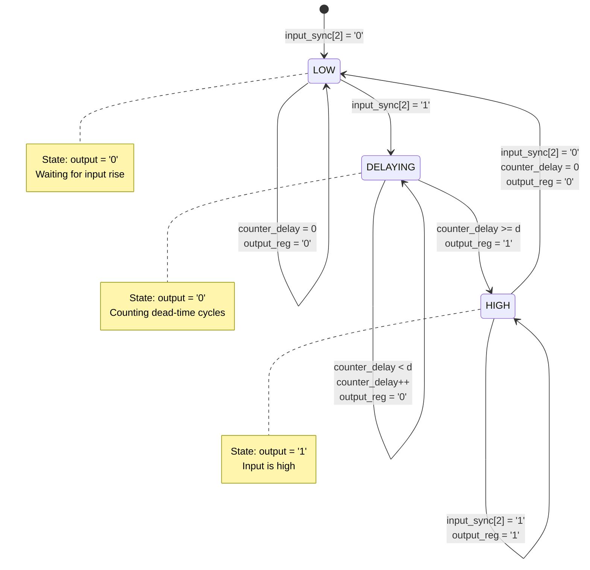
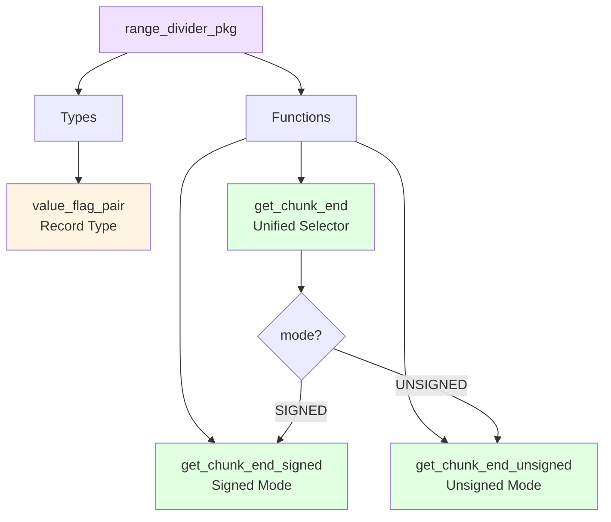

# Utility Modules

## Overview

The utility modules provide supporting functionality for the PWM system:

- **edge_delay.vhd**: Programmable delay element for dead-time insertion
- **pwm_clk_post_scaler.vhd**: Clock-enable post-scaler for buffered PWM frequency modes
- **range_divider_pkg.vhd**: Package for dividing value ranges across PWM channels

---

## pwm_clk_post_scaler.vhd - Buffered PWM Tick Post-Scaler

### Description

Generates a one-cycle `tick_ce` pulse from the raw `clk_pwm` domain. The top-level buffered PWM path uses this enable as the effective PWM clock tick instead of creating a fabric-divided clock.

### Entity Declaration

```vhdl
entity pwm_clk_post_scaler is
  port (
    clk     : in    std_logic;
    rst     : in    std_logic;
    div_sel : in    std_logic_vector(1 downto 0);
    tick_ce : out   std_logic
  );
end entity pwm_clk_post_scaler;
```

### Divider Encoding

| `div_sel` | Divider |
|-----------|---------|
| `"00"` | `/2` |
| `"01"` | `/4` |
| `"10"` | `/8` |
| `"11"` | `/16` |

`tick_ce` is asserted for one raw `clk_pwm` cycle every selected divider cycles. In `main.vhd`, changing `div_sel` is done while the buffered PWM path is held in reset.

---

## edge_delay.vhd - Edge Delay Element

### Description

Implements a programmable delay line that postpones signal transitions by a fixed number of clock cycles. Used primarily for dead-time insertion in PWM outputs.

### Block Diagram

```mermaid
graph TB
    CLK[clk]
    INPUT[input]

    subgraph "Edge Delay"
        SYNC[Input Synchronizer<br/>3-stage FF]
        
        subgraph "Delay Logic"
            CTRL{input_sync[2]?}
            COUNT[Counter<br/>0 to dead_cycles]
            DELAYED[output_reg]
        end
    end

    OUTPUT[output]

    CLK --> SYNC
    CLK --> COUNT
    INPUT --> SYNC
    SYNC --> CTRL
    CTRL --> COUNT
    COUNT --> DELAYED
    DELAYED --> OUTPUT

    style INPUT fill:#e1f5ff
    style OUTPUT fill:#e1ffe1
    style SYNC fill:#f0e1ff
    style COUNT fill:#fff4e1
```

### Entity Declaration

```vhdl
entity edge_delay is
  generic (
    r : integer := 7;   -- Counter width
    d : integer := 4    -- Number of dead-time cycles
  );
  port (
    clk    : in    std_logic;
    input  : in    std_logic;
    output : out   std_logic
  );
end entity edge_delay;
```

### Generics

| Generic | Type | Default | Description |
|---------|------|---------|-------------|
| `r` | integer | 7 | Counter bit width |
| `d` | integer | 4 | Delay duration in clock cycles |

### Ports

| Port | Direction | Width | Description |
|------|-----------|-------|-------------|
| `clk` | in | 1 | Clock input |
| `input` | in | 1 | Input signal |
| `output` | out | 1 | Delayed output signal |

### Operation



### Algorithm

```vhdl
main : process (clk) is
begin
  if rising_edge(clk) then
    -- 3-stage input synchronizer
    input_sync <= input_sync(1 downto 0) & input;

    if input_sync(2) = '0' then
      -- Input is low: reset counter and output
      output_reg    <= '0';
      counter_delay <= (others => '0');
    else
      -- Input is high: start delay counter
      if counter_delay < to_unsigned(dead_cycles_cons, r) then
        counter_delay <= counter_delay + 1;
        output_reg    <= '0';  -- Still in delay period
      else
        output_reg <= '1';     -- Delay complete
      end if;
    end if;
  end if;
end process;
```

### Timing Diagram

```
Clock:       ─┐ ┌─┐ ┌─┐ ┌─┐ ┌─┐ ┌─┐ ┌─┐ ┌─
             └─┘ └─┘ └─┘ └─┘ └─┘ └─┘ └─┘

input:       ────────┐                     ┌────────────────
                    │                     │
                    │                     │
                    └─────────────────────┘

input_sync[2]: ─────────┐                 ┌────────────────────
                        │                 │
                        └─────────────────┘

counter_delay: 0   1   2   3   4   0   0   0   0
                              ▲
                            d=4 cycles

output:      ─────────────────────┐          ┌─────────────────
                                  │          │
                                  │          │
                                  └──────────┘

               ◄── dead_time ──►
```

### Usage in PWM System

```vhdl
-- In pwm_1ch.vhd (both legs through one dead-time block):
dead_time_ctrl : entity work.dead_time_generator
  generic map (
    r           => r,
    dead_time_d => d
  )
  port map (
    clk       => clk,
    rst       => rst,
    pwm_in    => pwm_state,
    pwm_n_in  => pwm_n_state,
    pwm_out   => pwm,
    pwm_n_out => pwm_n
  );
```

### Dead-Time Waveform in PWM

```
pwm_state:    ────────┐              ┌──────────────────────
                      │              │
                      │              │
                      └──────────────┘

dead_time:      ──┐
                  │ (safe gap)
                  └────────────────────────────────────

pwm output:     ────────┐              ┌──────────────────────
                        │              │
                        │              │
                        └──────────────┘


pwm_n_state:    ┌──────────────────────────────────────┐
                │                                      │
                └──────────────────────────────────────┘

dead_time:      └────────────┐
                             │ (safe gap)
                             └────────────────────

pwm_n output:   ┌──────────────────────────────────────┐
                │                                      │
                └──────────────────────────────────────┘

                ◄──── dead_time (both edges) ────►
```

### Design Features

1. **Input Synchronization**: 3-stage flip-flop chain prevents metastability
2. **Programmable Delay**: Configurable via generic `d`
3. **Asymmetric Control**: Can be modified for rise/fall independent delay
4. **Resource Efficient**: Minimal logic, counter-based

---

## range_divider_pkg.vhd - Range Divider Package

### Description

Package that divides value ranges across multiple PWM channels to ensure proper phase relationships and prevent simultaneous switching.

### Package Structure



### Type Definitions

```vhdl
package range_divider_pkg is
  -- Return type: value + flag bit
  type value_flag_pair is record
    val  : integer;   -- Generated value
    flag : std_logic; -- Control flag (alternates with index LSB)
  end record value_flag_pair;

  -- Unified selector function
  function get_chunk_end (
    mode  : string;   -- "SIGNED" or "UNSIGNED"
    r     : positive; -- Bit-width parameter
    index : natural;  -- Chunk index (0 to n-1)
    n     : positive  -- Number of chunks (power of 2)
  ) return value_flag_pair;

  -- Signed version
  function get_chunk_end_signed (
    r     : positive;
    index : natural;
    n     : positive
  ) return value_flag_pair;

  -- Unsigned version
  function get_chunk_end_unsigned (
    r     : positive;
    index : natural;
    n     : positive
  ) return value_flag_pair;

end package range_divider_pkg;
```

### value_flag_pair Record

| Field | Type | Description |
|-------|------|-------------|
| `val` | integer | Initial value for counter |
| `flag` | std_logic | Direction control (updown) |

---

### get_chunk_end_signed

#### Description

Divides the signed range `[-2^(r-1), 2^(r-1)-1]` across multiple channels.

#### Patterns

**For n=2:**
```
Index  val   flag
  0    -63    0
  1    +63    1
```

**For n=4:**
```
Index  val   flag
  0    -63    0
  1    +63    1
  2      0    0
  3      0    1
```

**For n=8:**
```
Index  val   flag
  0    -63    0
  1    +63    1
  2      0    0
  3      0    1
  4     +31   0
  5     +31   1
  6     -31   0
  7     -31   1
```

#### Algorithm

```vhdl
function get_chunk_end_signed (
  r     : positive;
  index : natural;
  n     : positive
) return value_flag_pair is
  constant max_pos : integer := 2^(r-1) - 1;  -- +63 for r=7
  constant max_neg : integer := -max_pos;     -- -63 for r=7
  variable result  : value_flag_pair;
begin
  -- Flag = LSB of index (alternates 0,1,0,1...)
  result.flag := std_logic(to_unsigned(index, 32)(0));

  case n is
    when 2 =>
      if index = 0 then
        result.val := max_neg;  -- -63
      else
        result.val := max_pos;  -- +63
      end if;

    when 4 =>
      case index is
        when 0    => result.val := max_neg;   -- -63
        when 1    => result.val := max_pos;   -- +63
        when 2|3  => result.val := 0;
        when others => result.val := 0;
      end case;

    when 8 =>
      case index is
        when 0    => result.val := max_neg;       -- -63
        when 1    => result.val := max_pos;       -- +63
        when 2|3  => result.val := 0;
        when 4|5  => result.val := max_pos / 2;   -- +31
        when 6|7  => result.val := -max_pos / 2;  -- -31
        when others => result.val := 0;
      end case;

    when others =>
      -- Fallback: linear sweep
      if n = 1 then
        result.val := 0;
      else
        result.val := max_neg + (2*max_pos*index + n/2) / (n-1);
      end if;
  end case;

  return result;
end function;
```

---

### get_chunk_end_unsigned

#### Description

Divides the unsigned range `[0, 2^r-1]` across multiple channels.

#### Patterns

**For n=2:**
```
Index  val   flag
  0      0    0
  1    255    1
```

**For n=4:**
```
Index  val   flag
  0      0    0
  1    255    1
  2    127    0
  3    127    1
```

**For n=8:**
```
Index  val   flag
  0      0    0
  1    255    1
  2     64    0
  3    192    1
  4    127    0
  5    127    1
  6     32    0
  7    224    1
```

---

### get_chunk_end (Unified Selector)

#### Description

Dispatches to the appropriate function based on data type mode.

#### Algorithm

```vhdl
function get_chunk_end (
  mode  : string;
  r     : positive;
  index : natural;
  n     : positive
) return value_flag_pair is
  variable result : value_flag_pair;
begin
  if mode = "SIGNED" then
    return get_chunk_end_signed(r => r, index => index, n => n);
  elsif mode = "UNSIGNED" then
    return get_chunk_end_unsigned(r => r, index => index, n => n);
  else
    result.flag := '1';
    result.val  := -1;
    return result;
  end if;
end function;
```

---

## Usage in PWM System

### Channel Initialization

```vhdl
-- In pwm_mch_buf.vhd:
channels_gen : for i in 0 to num_channels - 1 generate
  -- Get chunk for this channel
  constant chunk : value_flag_pair := get_chunk_end(
    mode  => input_data_type,
    r     => r,
    index => i,
    n     => num_channels
  );

begin
  pwm_ich : component pwm_1ch
    generic map (
      r               => r,
      d               => d,
      ref_type        => ref_type,
      ref_init        => chunk.val,    -- Initial value from range divider
      ref_step        => ref_step,
      ref_updwn       => chunk.flag,   -- Direction from range divider
      input_data_type => input_data_type
    )
    port map (
      clk        => clk_pwm,
      rst        => rst,
      enable     => enable,
      input_wave => duty_cycle,
      pwm        => pwm(i),
      pwm_n      => pwm_n(i)
    );
end generate channels_gen;
```

### Example: 4-Channel Configuration

```
For r=7 (signed), n=4:

Channel 0:  ref_init = -63, ref_updwn = '0'  (starts negative, counts up)
Channel 1:  ref_init = +63, ref_updwn = '1'  (starts positive, counts down)
Channel 2:  ref_init =   0, ref_updwn = '0'  (starts at zero, counts up)
Channel 3:  ref_init =   0, ref_updwn = '1'  (starts at zero, counts down)

This ensures channels have different phase relationships!
```

### Phase Relationship Diagram

```
4-Channel Example (r=7, signed):

Channel 0:  ────╮              ╭────
                ╰──────────────╯

Channel 1:  ╭──────────────╮
            ╰              ╰

Channel 2:  ───────╮    ╭─────────
                   ╰────╯

Channel 3:          ╭────╮
            ╭───────╯    ╰───────

            ◄──── PWM Period ────►
```

---

## Design Rationale

### Why Divide Ranges?

1. **Phase Diversity**: Channels operate at different points in their cycles
2. **EMI Reduction**: Prevents simultaneous switching noise
3. **Power Distribution**: Spreads current draw across time
4. **Harmonic Cancellation**: Certain harmonics cancel in multi-phase systems

### Flag Purpose

The `flag` field controls the initial counting direction:
- `'0'`: Start counting down (or up, depending on implementation)
- `'1'`: Start counting up (or down)

This ensures channels begin at opposite ends of their range.

---

## Test Coverage

```
tb/
├── tb_range_divider_pkg.vhd  -- Package function tests
├── tb_pwm_mch.vhd            -- Integration tests
└── tb_output_control.vhd     -- Multi-channel output tests
```

### Test Scenarios

1. **Function Outputs**: Verify val/flag for all indices
2. **Power-of-2 Sizes**: Test n=2, 4, 8, 16
3. **Edge Cases**: n=1, large n
4. **Both Modes**: Signed and unsigned
5. **Resolution Scaling**: Various r values

---

## See Also

- [Counter Modules](../counters/README.md)
- [PWM Multi-Channel](../pwm/README.md#pwm_mch_bufvhd)
- [Edge Delay](#edge_delayvhd)
